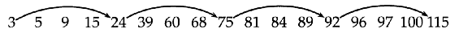

# Web 信息处理与应用 作业一

    傅申 PB20000051

## 1 计算题

> **1.1** 请推荐如下查询的处理次序。
>
> `(tangerine OR trees) AND (marmalade OR skies) AND (kaleidoscope OR eyes)`
> 
> 其中，每个词项对应的倒排记录表的长度分别如下：
> 
>|     词项     | 倒排记录表长度 |
> | :----------: | :------------: |
> |     eyes     |    213 312     |
> | kaleidoscope |     87 009     |
> |  marmalade   |    107 913     |
> |    skies     |    271 658     |
> |  tangerine   |     46 653     |
> |    trees     |    316 812     |

首先，保守地估计出每个 `OR` 操作后的结果大小：

- `tangerine OR trees`：$46 653 + 316 812 = 363 465$
- `marmalade OR skies`：$107 913 + 271 658 = 379 571$
- `kaleidoscope OR eyes`：$87 009 + 213 312 = 300 321$

然后，按照结果从小到大的顺序执行 `AND`，即先处理 `kaleidoscope OR eyes` 和 `tangerine OR trees` 进行 `AND` 操作的结果，然后再和 `marmalade OR skies` 进行 `AND` 操作。

> **1.2** 考虑利用如下带有跳表指针的倒排记录表
> 
> 和一个中间结果表（如下所示，不存在跳表指针）进行合并操作。
>
> $3\quad 5\quad 89\quad 95\quad 97\quad 99\quad 100\quad 101$
>
> 采用基于跳表指针的倒排记录表合并算法，请问：
>
> 1. 跳表指针实际发生跳转的次数是多少？
> 2. 当两个表进行合并时，倒排记录之间的比较次数是多少？
> 3. 如果不使用跳表指针，那么倒排记录之间的比较次数是多少？

查询处理过程为：

- 遍历发现共同记录 $3$ 和 $5$，继续移动指针；
- 倒排记录表在 $24$ 的位置发现跳表指针 $75$ 小于中间结果表的下一个数 $89$，因此直接将倒排记录表跳到 $75$；
- 继续移动指针，发现共同记录 $89$、$87$ 和 $100$。

因此

1. 实际发生跳转的次数为 1；

2. 倒排记录之间的比较次数为 18，如下（其中加 $*$ 的为跳表指针比较）
   $$
   \begin{array}
   \text{倒排记录表} & 3 & 5 &  9 & 15 & 24 & 75^* & 92^* & 81 & 84 & 89 & 92 & 115^* & 96 & 96 & 97 & 100 & 100 & 115 \\
   \text{中间结果表} & 3 & 5 & 89 & 89 & 89 & 89 & 89 & 89 & 89 & 89 & 95 &  95 & 95 & 97 & 97 & 99  & 100 & 101
   \end{array}
   $$

3. 如果不使用跳表指针，倒排记录之间的比较次数为 19，如下

      $$
      \begin{array}
      \text{倒排记录表} & 3 & 5 &  9 & 15 & 24 & 39 & 60 & 68 & 75 & 81 & 84 & 89 & 92 & 96 & 96 & 97 & 100 & 100 & 115 \\
      \text{中间结果表} & 3 & 5 & 89 & 89 & 89 & 89 & 89 & 89 & 89 & 89 & 89 & 89 & 95 & 95 & 97 & 97 & 99  & 100 & 101
      \end{array}
      $$

> **1.3** 写出倒排记录表 $(777, 17743, 294068, 31251336)$ 的可变字节编码。在可能的情况下对间距而不是文档 ID 编码。写出 8 位块的二元码（即可变长度编码）。

|   文档 ID   |          777           |         17743          |                294068                |                      31251336                      |
| :---------: | :--------------------: | :--------------------: | :----------------------------------: | :------------------------------------------------: |
|  **间距**   |                        |         16966          |                276325                |                      30957268                      |
| **VB 编码** | 00000011 00001001 | 01000010 01000110 | 00000100 00110111 01100101 | 00000001 11011000 01011110 11010100 |

8 位块的二元码为 `00000011 00001001 01000010 01000110 00000100 00110111 01100101 00000001 11011000 01011110 11010100`。

> **1.4** 假设有三个城市，编号分别为 1、2、3。现在有一个商人在三个城市之间来回穿梭，已 知三个城市作为起点的概率分别为 $(0.2, 0.4, 0.4)$ 。同时，这个商人在城市之间旅行或同城停留的跳转概率如下表所示：
>
> | 城市编号 | → 1  | → 2  | → 3  |
> | :------: | :--: | :--: | :--: |
> |    1     | 0.5  | 0.2  | 0.3  |
> |    2     | 0.3  | 0.5  | 0.2  |
> |    3     | 0.2  | 0.3  | 0.5  |
>
> 同时，还知道三座城市各自晴天/雨天的概率如下表所示：
>
> | 城市编号 | 晴天概率 | 雨天概率 |
> | :------: | :------: | :------: |
> |    1     |   0.5    |   0.5    |
> |    2     |   0.4    |   0.6    |
> |    3     |   0.7    |   0.3    |
>
> 在某一次旅行中，商人连续三天观测到的天气状态是（晴天、雨天、晴天），请问，这三天内该名商人最有可能的旅行轨迹是什么？请给出计算过程。

- 所有可能状态的集合 $S = \{s_1, s_2, s_3\}$；
- 状态序列为 $I = (s_{i_1}, s_{i_2}, s_{i_3})$，对应的观测序列为 $W = (w_1, w_2, w_3) = (晴天,雨天,晴天)$； 
- 隐含状态转移概率矩阵为 $\boldsymbol{A} = [a_{ij}]_{3\times 3} = \begin{pmatrix}0.5 & 0.2 & 0.3 \\ 0.3 & 0.5 & 0.2 \\ 0.2 & 0.3 & 0.5\end{pmatrix}$；
- 观测状态概率矩阵为 $\boldsymbol{B} = [b_j(k)]_{3\times 2} = \begin{pmatrix}0.5 & 0.5 \\ 0.4 & 0.6 \\ 0.7 & 0.3\end{pmatrix}$；
- 初始状态概率向量 $\boldsymbol{\pi} = (\pi_1, \pi_2, \pi_3) = (0.2, 0.4, 0.4)$。

在 $t = 1$ 时，对每个状态 $s_i$，计算状态为 $s_i$ 观测 $w_1$ 为晴天的概率 $\delta_1(s_i) = \pi_i b_i(w_1)$：
$$
\begin{aligned}
\delta_1(s_1) &= 0.2 \times 0.5 = 0.1 \\
\delta_1(s_2) &= 0.4 \times 0.4 = 0.16 \\
\delta_1(s_3) &= 0.4 \times 0.7 = 0.28
\end{aligned}
$$
在 $t = 2$ 时，对每个状态 $s_i$，求在 $t = 1$ 时状态为 $s_j$ 观测为晴天并在 $t = 2$ 时状态为 $s_i$ 观测 $w_2$ 为雨天的路径的最大概率
$$
\delta_2 (s_i) = \max_{1 \leq j \leq 3} \{\delta_1(s_j)a_{ji}\} b_i(w_2)
$$
同时，对每个状态 $s_i$，记录概率最大路径的前一个状态 $s_j$ 所对应的下标
$$
j = \varPsi_2(s_i) = \arg\max_{1\leq j \leq 3} \{\delta_1(s_j)a_{ji}\}
$$
计算得到
$$
\begin{aligned}
\delta_2(s_1) &= 0.028  &\varPsi_2(s_1) &= s_3 \\
\delta_2(s_2) &= 0.0504 &\varPsi_2(s_2) &= s_3 \\
\delta_2(s_3) &= 0.042  &\varPsi_2(s_3) &= s_3
\end{aligned}
$$
同理可得 $t = 3$ 时
$$
\begin{aligned}
\delta_3(s_1) &= 0.00756 &\varPsi_3(s_1) &= s_2 \\
\delta_3(s_2) &= 0.01008 &\varPsi_3(s_2) &= s_2 \\
\delta_3(s_3) &= 0.0147  &\varPsi_3(s_3) &= s_3
\end{aligned}
$$
因此最优路径的终点下标 $i_3^* = 3$，逆向找到 $i_2^* = 3$，$i_1^* = 3$，即该名商人最有可能的旅行轨迹是 $(3, 3, 3)$。

## 2 问答题（言之有理即可）

> **2.1** 针对海量数据爬取的任务，在商用环境下往往采用分布式爬虫，通过对 URL 的哈希结果来进行任务分配。然而，服务器陷阱、节点崩溃等原因将导致在实际运行中会出现节点的减少或新增。请思考在节点数量动态变更的情况下，采用何种策略可以保障负载均衡？

可以使用一致性哈希算法来分配任务，并使用虚拟节点机制。一致性哈希算法具有良好的容错性和扩展性，可以应对节点数量变化的情况，而虚拟节点机制能保证相对均匀的负载。

> **2.2**  如何结合查询词项的分布细节，预设相对合理的跳表指针步长（和跳表层数），或实现跳表指针步长的动态调节？

- 静态参数选择：可以在查询词项分布密集（稀释）处设置较长（短）的跳表指针步长。
- 动态参数调整：在运行时，监控查询操作的性能；如果查询性能不佳，可以考虑增加步长或层数以加快搜索速度；如果内存使用过多，可以减小层数以降低空间开销。

> **2.3** 在信息检索系统中，如何同时使用位置索引（对倒排索引的位置信息扩展）和停用词表？潜在问题有哪些，如何解决？

- 如何使用：对于非停用词使用位置索引进行记录，对于停用词进行忽略；
- 潜在问题：
  - 部分停用词在特定场景下是有意义的。解决方法：使用统一的记号代替停用词，用于大致推断其信息；
  - 部分停用词的组合是有意义的。解决方法：使用更好的分词策略。

> **2.4** 机械分词的缺陷之一在于词汇频率无法对分词结果产生影响。请设计方案将词汇概率融入正/反向最大匹配分词，以提升分词效果。并考虑：在此种方案下，反向最大匹配分词的效果是否仍优于正向最大匹配分词，为什么？

- 设计方案：首先建立统计语言模型，然后在进行机械分词（正/反向最大匹配分词）时，我们尽可能查找概率最大的词，而不是最长的词。
- 在此种方案下，反向最大匹配分词的效果仍优于正向最大匹配分词，这是自然语言左歧义频率高于右歧义频率的特性所决定的

> **2.5** Trie 树的缺陷在于“以空间换效率”，对于存储空间的压力较大。如何结合英文/中文的语言特点，适当放宽限定，以节约 Trie 树的存储空间？同时，请分析这一改进下对于查询效率的影响。

- 对于英文等自然语言，不同的词语拥有相同的前缀是很常见的，因此可以使用压缩 Trie 树来节约存储空间。
- 对于包含大量短词的中文，可以考虑合并短词来节约存储空间。

这些改进并不会对查询效率造成太大的影响，因为我们仅仅对部分相邻的节点进行了合并，没有增加比较的次数。
