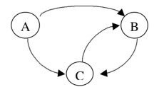

# Web 信息处理与应用 作业二

    傅申 PB20000051

## 1 计算题

> **1.1** 给定以下词项的 idf 值，以及在三篇文档中的 tf，已知总文档数为 811,400，请完成如下计算任务：
>
> |           |   df   | tf@Doc1 | tf@Doc2 | tf@Doc3 |
> | :-------: | :----: | :-----: | :-----: | :-----: |
> |    Car    | 18,871 |   34    |    8    |   32    |
> |   Auto    | 3,597  |    3    |   24    |    0    |
> | Insurance | 19,167 |    0    |   51    |    6    |
> |   Best    | 40,014 |   18    |    0    |   13    |
>
> 1. 计算所有词项的 tf-idf 值。
> 2. 试采用欧式归一化方法（即向量各元素平方和为 1），得到处理后的各文档向量化表示，其中每个向量为 4 维，每一维对应 1 个词项。
> 3. 基于 2 中得到的向量化表示，对于查询向量 $(1, 0, 1, 0)$，计算 3 篇文档的得分并进行排序。

1. 由 $\displaystyle W_{t,d} = \left(1 + \log {tf}_{t,d}\right)\cdot\log\frac{N}{df_t}$ 计算得到所有词项的 tf-idf 值如下：

   |           | Doc1  | Doc2  | Doc3  |
   | :-------: | :---: | :---: | :---: |
   |    Car    | 4.135 | 3.109 | 4.092 |
   |   Auto    | 3.476 | 5.601 |   0   |
   | Insurance |   0   | 4.404 | 2.892 |
   |   Best    | 2.948 |   0   | 2.763 |

2. 归一化后得到：

   | 文档 |            向量            |
   | :--: | :------------------------: |
   | Doc1 | $(0.672, 0.565, 0, 0.479)$ |
   | Doc2 | $(0.400, 0.720, 0.567, 0)$ |
   | Doc3 | $(0.715, 0, 0.505, 0.483)$ |

3. 计算文档向量与查询向量的夹角的余弦值 $\cos \left(\vec{q}, \vec{d}\right)$ 如下：

   | 文档 | $\cos \left(\vec{q}, \vec{d}\right)$ |
   | :--: | :----------------------------------: |
   | Doc1 |                0.475                 |
   | Doc2 |                0.684                 |
   | Doc3 |                0.863                 |

   因此，三篇文档的排序依次为：Doc3，Doc2，Doc1。

> **1.2** 考虑下图的网络结构图
>
> 
>
> 1. 当 Restart 部分的随机跳转概率为 0.15 时，写出 PageRank 的（随机）转移概率矩阵。
> 2. 计算各个节点所对应的 PageRank 值、Hub 值和 Authority 值。

1. 首先写出网络结构图的邻接矩阵 $\boldsymbol{M} = \begin{pmatrix}0 & 1 & 1 \\ 0 & 0 & 1 \\ 0 & 1 & 0\end{pmatrix}$，转置后归一化得到跳转矩阵 $\boldsymbol{R} = \begin{pmatrix}0 & 0 & 0 \\ 0.5 & 0 & 1 \\ 0.5 & 1 & 0\end{pmatrix}$，可计算得转移概率矩阵如下
   $$
   \boldsymbol{A}
   & = d\boldsymbol{R} + \frac{1-d}{N}\boldsymbol{e}\boldsymbol{e}^{\mathrm{T}} = 0.85 \times \begin{pmatrix}0 & 0 & 0 \\ 0.5 & 0 & 1 \\ 0.5 & 1 & 0\end{pmatrix} + \frac{0.15}{3} \times \begin{pmatrix}1 & 1 & 1 \\ 1 & 1 & 1 \\ 1 & 1 & 1\end{pmatrix} = 
   \begin{pmatrix}
   	0.05 & 0.05 & 0.05 \\
   	0.475 & 0.05 & 0.9 \\
   	0.475 & 0.9 & 0.05
   \end{pmatrix}
   $$
   
2. 首先，计算 PageRank 值，即相当于解 $\dfrac{1-d}{N} \boldsymbol{e} + d\boldsymbol{R}\cdot \boldsymbol{PR} = \boldsymbol{PR}$，解得
   $$
   \boldsymbol{PR} = \begin{pmatrix} 0.05 \\ 0.475 \\ 0.475 \end{pmatrix}
   $$
   然后计算 Hub 值 $\boldsymbol{h}$ 和 Authority 值 $\boldsymbol{a}$，相当于解 $\boldsymbol{a} = \dfrac{\boldsymbol{M}^{\mathrm{T}}\boldsymbol{h}}{|\boldsymbol{M}^{\mathrm{T}}\boldsymbol{h}|}, \boldsymbol{h} = \dfrac{\boldsymbol{M}\boldsymbol{a}}{|\boldsymbol{M}\boldsymbol{a}|}$，解得
   $$
   \boldsymbol{h} = \begin{pmatrix} \dfrac{\sqrt{6}}{3} \\ \dfrac{\sqrt{6}}{6} \\ \dfrac{\sqrt{6}}{6} \end{pmatrix}, \boldsymbol{a} = \begin{pmatrix} 0 \\ \dfrac{1}{\sqrt{2}} \\ \dfrac{1}{\sqrt{2}} \end{pmatrix}
   $$
   

> **1.3** 在由 10,000 篇文档构成的文档集中，某个查询的相关文档总数为 10，下面给出了针对该查询的前 20 个有序结果，其中 `R` 表示相关，`N` 表示不相关。
>
> `R R N N R	N N N R N	R N N N R	N N N N R`
>
> 请计算：
>
> 1. 该查询的 P@10 和 P@20 分别是多少？
> 2. 为什么 P、R@N 可能会出现理论上限小于 1 的情况？
> 3. 该查询前 10 篇文档和前 20 篇文档的 F1 值分别是多少？
> 4. 当该算法只返回前 20 个结果时，其简化 AP 值为多少？

1. 前 10 篇查询结果中有 4 篇相关，因此 $\mathrm{P@10} = 0.4$；前 20 篇查询结果中有 7 篇相关，因此 $\mathrm{P@20} = 0.35$

2. 显然前 N 个查询结果中至多有 N 个相关的文档，因此 P@N 的上限为 1；假设查询的相关文档总数为 M，则前 N 个结果中至多有 $\min(M, N) \le M$ 个相关文档，因此 R@N 的上限为 1

3. 前 10 篇文档的查询结果 $P = 0.4, R = 0.4$，因此 $F1 = 0.4$；前 20 篇文档的查询结果 $P = 0.35, R = 0.7$，因此 $F1 = \dfrac{7}{15} \approx 0.467$

4. 简化 AP 值如下
   $$
   AP = \frac{1}{7}\left(\frac{1}{1}+\frac{2}{2}+\frac{3}{5}+\frac{4}{9}+\frac{5}{11}+\frac{6}{15}+\frac{7}{20}\right) = 0.607
   $$
   

## 2 问答题

> **2.1** 文本评论是一种较为复杂的用户反馈。通常情况下我们会借助用户评论的倾向性来辅助理解用户的满意程度。然而，部分用户在反馈时可能存在“反话正说”的情况，从而对于我们判断用户满意度造成干扰。以 USTC 评课社区中“大学物理实验”的评价为例：
>
> 
>
> 1. 你认为用户留下的哪些信息（不限该页面）有助于我们判断“反话正说”的现象？
> 2. 请设计一种机制，在不借助复杂自然语言处理技术进行语义表征的前提下，实现“反话正说”现象的有效判别？

1. 如下
   - **句式、语法与修辞**：用户在“反话正说”时很可能采用不常见的句式、语法或者修辞，比如采用反问、诘问、夸张和讽刺等语法的评论常常是不正常的“反话正说”评论；
   - **情感**：用户在留下“反话正说”评论时可能会在评论中体现出完全相反的情绪，利用情感分析技术可能能将其分析出来；
   - **上下文信息**：用户在“反话正说”时可能会留下与评论对象完全无关的信息，可以通过分析上下文以及其他评论判断。
2. 根据上面的分析，可以采用下面的机制：
   - 检索评论中的情感相关词汇，分析是否存在多个不符合逻辑的情感的组合；
   - 检索评论中是否存在某些语法特征，以判断是否使用了不常见的语法；
   - 根据其他用户的整体评价，分析评论是否与整体评价差异过大。

> **2.2** 用户在浏览网页时，可能通过点击“后退”按钮回到上一次浏览的页面。用户的这种回退行为（包括连续回退行为）能否用马尔科夫链进行建模？为什么？

不能使用马尔科夫链进行建模，因为用户的回退行为不仅仅与用户上一次浏览的页面有关，还与用户更早浏览的页面有关，这与马尔科夫链的“无记忆”性质是矛盾的。

> **2.3** 在用户意图尚不明确的情况下，使搜索结局具有一定多样性，以确保可能具有不同意图的用户都能够获得相应反馈，是一种常见的排序策略。请简要回答下列问题：
>
> 1. 如何在网页排序的同时提升结果的多样化水平？如何在此同时保障算法的效率？
> 2. 在用户通过点击行为等反馈方式表达了更为具体的意图之后，是否还需要保持结果的多样化？为什么？

1. 如下

   - **提升结果的多样化水平**：可以修改排序器的学习目标，使其体现多样性指标。同时，在搜索结果中引入多样性采样，以确保不同主题或类型的结果在前几页中都有出现。还可以在排序过程中考虑主题分布的调整

   - **保障算法的效率**：可以增量计算技术，只在需要时计算多样性指标，同时对其进行缓存

2. 不需要保持结果的多样化，因为用户已经表达了更明确的意图，这时再保持多样化反而会提供与用户意图不符的信息。

> **2.4** Pairwise 类排序学习方法由于需要对排序样本进行两两成对，导致样本数大为提升，从而造成了计算资源开支的严重增加。试讨论，是否可以减少需要比较的样本对以提升排序效率？如何进行样本对的筛选，并抑制对于排序精度的干扰？

可以通过采样减少需要比较的样本对。在筛选中，可以采用下面的策略来抑制对于排序精度的干扰：

- 定义一个阈值，只选择那些排序差异大于阈值的样本对进行比较；
- 分析特征的相关性，选择那些具有高相关性的特征，只考虑与这些特征相关的样本对；
- 在进行样本对筛选时，可以考虑样本对中正例和负例的平衡

