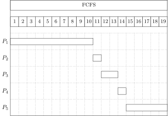
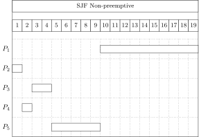
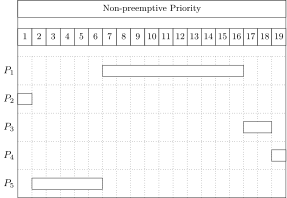
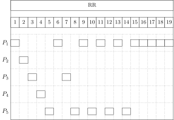
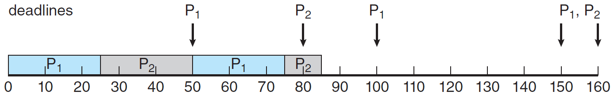
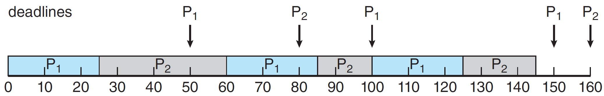

---
puppeteer:
  landscape: true
  format: "A4"
  timeout: 3000 # <= Special config, which means waitFor 3000 ms
---

<!--
 Copyright (c) 2022 Fr4nk1in-USTC
 
 This software is released under the MIT License.
 https://opensource.org/licenses/MIT
-->

# 操作系统作业 3
<center>傅申 PB20000051</center>

## 
要求:
1. Mutual Exclusion 互斥 
    - No two processes could be simultaneously executing inside their critical section.
2. Progress 进步
    - No progress running outside its critical section should block other processes.
3. Bounded Waiting 有限等待
    - No progress would have to wait forever in order to enter its critical section.
4. \* Each process is executing at a non-zero speed, but no assumption should be made about the relative speed of the processes and the number of CPUs.

Strict Alternation 没有满足要求 2 Progress. 如果轮转到一个不会进入临界区的进程, 其他进程会被阻塞, 从而违背要求 2 Progress.

##
Peterson's Solution 的进程 $P_i$ 结构如下
```java
do {
    // Section Entry
    flag[i] = true;
    turn = j;
    while (flag[j] && turn == j) ; // busy waiting

    // Critical Section
    criticalSection();

    // Section Exit
    flag[i] = false;

    // Remainder Section
    remainderSection();
} while (true);

```
- [x] 互斥: 只有当 `flag[j] == false` 或 `turn == i` 时, 进程 $P_i$ 才可以进入临界区. 如果两个进程 $P_i$ 和 $P_j$ 同时在临界区执行, 说明 `flag[0] == flag[1] == true`, 而 `turn` 只能为 0 或 1, 所以两个进程不可能同时成功执行完 `while` 语句, 所以只能有一个进程进入临界区, 互斥成立.
- [x] 进步: 
    - 如果 $P_j$ 不准备进入临界区, `flag[j] == false`, $P_i$ 能进入临界区.
    - 如果 $P_j$ 已经设置 `flag[j] = true` 且也在执行 `while` 语句, 那么 `turn == i` 或 `turn == j`
        - 如果 `turn == i`, $P_i$ 可以进入临界区.
        - 如果 `turn == j`, $P_j$ 进入临界区
            - 在它退出临界区时, 会设置 `flag[j] = false`, 允许 $P_i$ 进入临界区. 
            - 即使它重新设置 `flag[j] = true`, `turn` 也会被重新设置为 `i`, $P_i$ 会进入临界区. 
- [x] 有限等待: 同上面的步骤, 可以看出 $P_i$ 在 $P_j$ 进入临界区后最多一次就能进入临界区.

## 
死锁是等待的进程相互持有其他等待进程需要的系统资源, 导致所有进程被阻塞的情况. 
必要条件:
1. Mutual Exclusion 互斥
2. Hold & Wait 占有并等待
3. No Preemption 非抢占
4. Circular Wait 循环等待

## 
a. 安全, 一个可能的完成顺序: $T_4\to T_0\to T_1\to T_2\to T_3$ 
b. 安全, 一个可能的完成顺序: $T_2\to T_4\to T_1\to T_0\to T_3$
c. 不安全, 因为现有的资源不能满足任何线程对 B 的需求.
d. 安全, 一个可能的完成顺序: $T_3\to T_1\to T_2\to T_0\to T_4$

## 
Semaphore 是信号量, 在实现中它是一个数据类型, 只能被原子操作修改.

在进程同步中, 二进制信号量类似于互斥锁, 可以用于提供互斥; 计数信号量可以用于控制访问具有多个实例的某种资源.

##
需要下面的共享数据:
- `state[N]`: 枚举类型, 表示各个哲学家的状态 (thinking, eating, or sleeping)
- `mutex`: 互斥锁, 保证对共享数据的访问互斥.
- `s[N]`: 用于保证进程同步要求

大致流程如下, 这个方案中没有筷子的概念.
1. 当左右两个哲学家没有在进餐且自己饥饿时, 可以进餐, 否则阻塞.
2. 当进餐结束后, 尝试让左右两个哲学家进餐 (唤醒左右哲学家).

##
### Gantt Charts
- FCFS

- SJF

- Non-preemptive Priority: 使用 FCFS 来处理相同的优先级:

- RR

### Turnaround Time
| Process | FCFS | SJF | Priority | RR  |
|:-------:|:----:|:---:|:--------:|:---:|
|  $P_1$  |  10  | 19  |    16    | 19  |
|  $P_2$  |  11  |  1  |     1    |  2  |
|  $P_3$  |  13  |  4  |    18    |  7  |
|  $P_4$  |  14  |  2  |    19    |  4  |
|  $P_5$  |  19  |  9  |     6    | 14  |
### Waiting Time
| Process | FCFS | SJF | Priority | RR  |
|:-------:|:----:|:---:|:--------:|:---:|
|  $P_1$  |   0  |  9  |     6    |  9  |
|  $P_2$  |  10  |  0  |     0    |  1  |
|  $P_3$  |  11  |  2  |    16    |  4  |
|  $P_4$  |  13  |  1  |    18    |  3  |
|  $P_5$  |  14  |  4  |     1    |  9  |
| Average |  9.6 | 3.2 |    8.2   | 5.2 |
### 
SJF results in the minimum average waiting time.
### Pros & Cons
- FCFS
    - 优点: 代码编写简单且理解容易
    - 缺点: 对输入顺序敏感, 平均等待时间往往很长
- SJF
    - 优点: 可以证明 SJF 调度算法是最优的, 平均等待时间最小
    - 缺点: 无法知道下次 CPU 执行的长度
- Priority
    - 优点: 易于使用, 高优先级的进程会优先执行
    - 缺点: 无穷阻塞和饥饿
- RR
    - 优点: 拥有较高的效率和响应速度
    - 缺点: 平均等待时间通常较长
---
##
- Rate-monotonic Scheduling
    - 进程是周期性的.
    - 对于每次 CPU 执行, 周期性进程的处理时间是相同的.
    - 每个进程都被分配一个固定优先级.
- Earliest-deadline-first Scheduling
    - 每个进程都有一个 Deadline
    - 每个进程的优先级是动态的, 根据 Deadline 调整.

对于 $p_1=50, t_1=25$, $p_2=80, t_2=35$ 的情况, Rate-monotonic Scheduling 无法完成规划, 如下

但是 Earliest-deadline-first Scheduling 可以正常规划, 如下

