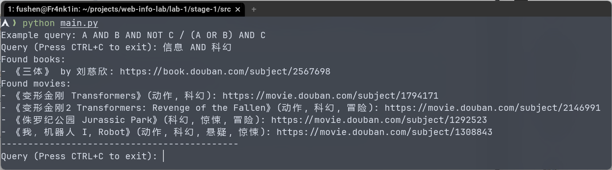
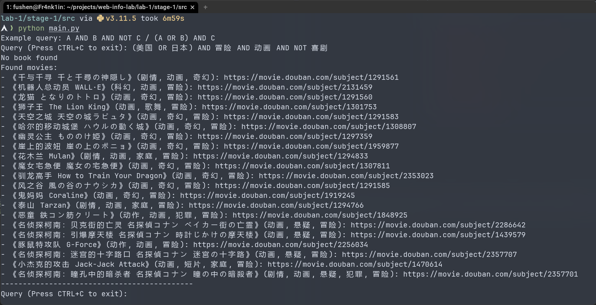
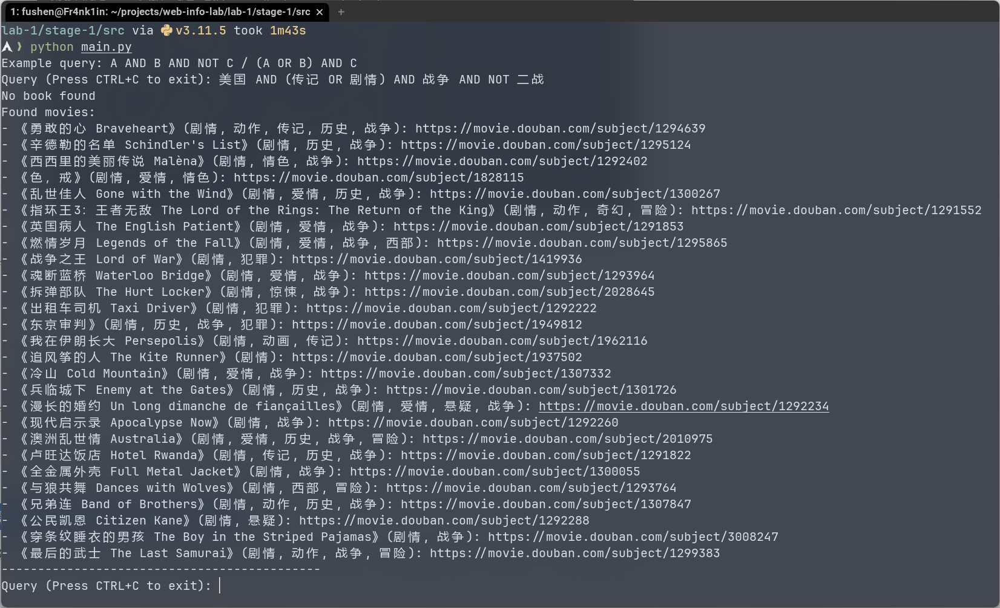
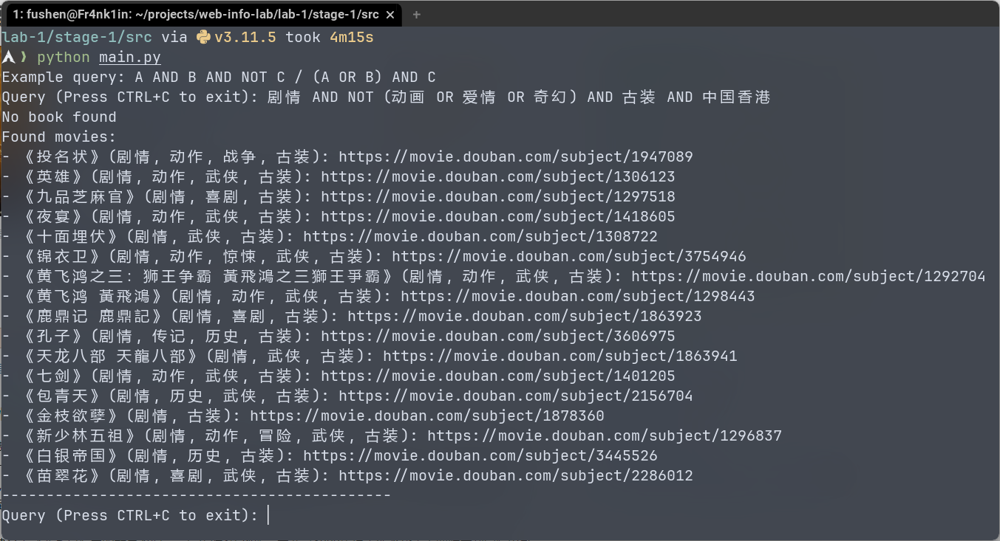

# Web 信息处理实验一 实验报告

<center>
    翁屹禾  PB20000017<br/>
    傅申  PB20000051<br/>
    侯博文 PB20000054
</center>


[toc]

## 第 1 阶段：豆瓣数据的爬取与检索

该阶段的代码结构如下：

```txt
stage-1
├── data
│   ├── book.json        <- 爬取的书籍数据
│   ├── book_tag.csv     <- 实验提供的书籍 ID/tag 数据
│   ├── cookies.json     <- 爬虫使用的 cookies
│   ├── movie_error.json <- 无法爬取的电影 ID
│   ├── movie.json       <- 爬取的电影数据
│   ├── movie_tag.csv    <- 实验提供的电影 ID/tag 数据
│   ├── stopwords.txt    <- 停用词表
│   └── database         <- 根据爬取的数据构建的倒排索引表 (因为项目过多, 提交的文件夹都是空文件)
│       ├── book
│       │   ├── all_ids
│       │   ├── index/*.idx
│       │   └── indices
│       └── movie
│           ├── all_ids
│           ├── index/*.idx
│           └── indices
├── requirements.txt
└── src
    ├── bool_query.py     <- 布尔检索实现
    ├── inverted_index.py <- 倒排索引实现
    ├── main.py           <- 主程序, 实现对书籍和电影的检索
    ├── preprocess.py     <- 数据预处理
    └── spider.py         <- 爬虫
```

### 爬虫

爬虫的代码位于 `stage-1/src/spider.py`，其采用网页爬取的方式，使用 `lxml` 库解析网页的 HTML，从而获取书籍/电影的相关信息。

我们的爬虫爬取了书籍的标题、评分、作者、出版社、原作名、译者、出版年份、页数、定价、装帧、系列、ISBN、简介和作者简介，以及电影的标题、评分、导演、编剧、主演、类型、制片国家/地区、语言、上映日期、片长、又名、IMDb、电影简介和演职员，这些数据采用 JSON 格式存储。

#### 解析方法

以爬取书籍信息的代码为例，对于每一个提供的 ID，爬虫首先会尝试向对应的 URL 发送请求，在收到正常 HTTP 响应后，使用 XPath 解析 HTML 内容，并组织相关信息返回：

```py
def get_book_info(
    book_id: int, cookies: Optional[dict[str, str]] = None
) -> Optional[dict[str, Any]]:
    # send request and get response
    url = BASE_BOOK_URL + str(book_id)

    try:
        response = requests.get(url, headers=HEADERS, cookies=cookies)
    except requests.exceptions.ConnectionError:
        msg.fail(f"(Connection Error) {url}")
        return None

    if response.status_code != 200:
        msg.fail(f"({response.status_code}) {url}")
        return None
    else:
        msg.good(f"({response.status_code}) {url}", show=SHOW_SUCCESS)

    # parse html
    tree = html.fromstring(response.text)
    info: dict[str, Any] = {"id": book_id}
    for k, v in BOOK_XPATHS.items():
        if isinstance(v, list):
            for xpath in v:
                info[k] = [
                    info.strip() for info in tree.xpath(xpath) if info.strip() != ""
                ]
                if len(info[k]) != 0:
                    break
        else:
            info[k] = [info.strip() for info in tree.xpath(v) if info.strip() != ""]
    return info
```

在爬虫获得 ID 对应书籍/电影的相关信息后，如果提供的数据中有该 ID 对应的 tag，爬虫也会将 tag 加入信息中：

```python
id = int(book_id["Id"])
info = get_book_info(id, cookies)
if info is not None:
    tag = book_id["Tag"]
    info["tags"] = str(tag).split(",") if tag == np.nan else []
    book_datas.append(info)
else:
    errors.append(id)
```

#### 反爬策略

在编写和运行爬虫的过程中，我们发现豆瓣平台存在下面的反爬措施：

- 对于部分 ID，其对应的页面只能在登录后查看；
- 若同一 IP 地址的流量存在异常，则只允许登录用户查看页面；
- 若用户的查询频率过高，则会认为用户可能是机器人，用户需要输入验证码才能查询页面（用户也可能被临时封禁）

对于这些措施，我们采用下面的应对方式：

- 使用 cookies 模拟用户登录：

  ```py
  cookies = load_cookies()
  # 下面的函数会在发送请求时使用 Cookies
  scrape_books(cookies)
  scrape_movies(cookies)
  ```

- 在两次查询中插入 2 到 5 秒的随机停顿，降低查询频率：

  ```py
  def sleep() -> None:
      """Random sleep for 2 - 5 seconds to avoid being blocked."""
      time.sleep(random.randint(2, 5))
  
  def scrape_books(cookies: Optional[dict[str, str]] = None) -> list[str]:
      book_ids = pandas.read_csv(BOOK_TAG_PATH)
      book_datas = []
      num_books = book_ids.shape[0]
      errors = []
      with PROGRESS_BAR as p:
          for _, book_id in p.track(
              book_ids.iterrows(),
              description="Scraping books...",
              total=num_books,
          ):
              # ...
              sleep() # 随机停顿 2 - 5 秒
  
      with open(BOOK_DATA_PATH, "w") as f:
          json.dump(book_datas, f, ensure_ascii=False, indent=2)
  
      return errors
  ```

在采用了上面的策略后，我们能够爬取几乎全部的数据，除了一部 ID 为 `1309046` 的电影（经查询，该电影可能为《V 字仇杀队》，已被禁播）。

### 检索

#### 预处理

预处理的代码位于 `stage-1/src/preprocess.py`，它将我们爬取的数据处理为关键字和 ID 的映射，并存储在倒排索引表中。

对于书籍，我们使用下面的信息进行分词：

- 标题
- 作者
- 出版社
- 系列
- 简介
- tag

对于电影，我们使用下面的信息进行分词：

- 标题
- 类型
- 制片国家/地区
- 语言
- 电影简介
- tag

我们采用[结巴中文分词](https://github.com/fxsjy/jieba)对信息进行分词，并使用 `stage-1/data/stopwords.txt` 中的停用词来处理。以对书籍信息的处理过程为例，我们将上面提到的信息一一分词为一系列关键字，然后在这些关键字中去除掉停用词，最后返回处理后的关键词集合：

```py
def book_keyword_generator():
    books = load_book_data()
    stopwords = load_stopwords()
    for data in books:
        id = int(data["id"])
        keywords = set()
        for entry in USEFUL_BOOK_ENTRIES:
            for string in data[entry]:
                tokens = [token.strip() for token in jieba.cut(string, cut_all=False)]
                keywords |= set(tokens)
        keywords -= stopwords
        yield id, keywords
```

使用上面的 Generator，我们可以建立关键字和 ID 之间的映射：

```py
book_keywords_to_id = {}
for book_id, keywords in book_keyword_generator():
    for keyword in keywords:
        if keyword not in book_keywords_to_id:
            book_keywords_to_id[keyword] = set()
        book_keywords_to_id[keyword].add(book_id)
```

最后根据信息映射建立倒排索引表：

```py
book_index = InvertedIndex(BOOK_DATABASE_DIR)
for keyword, book_ids in book_keywords_to_id.items():
    book_index.set(keyword, book_ids)
book_index.save()
```

#### 倒排索引表

倒排索引的实现位于 `stage-1/src/inverted_index.py`，考虑到实验的规模和需要进行的处理，我们选择 Python 自带的集合 `set[int]` 作为存储倒排索引记录的数据结构。我们具体定义了下面三个数据结构：

```py
# 单个关键字对应的倒排索引记录
class InvertedRecord:
    def __init__(self, doc_ids: set[int]) -> None:
        self.doc_ids = doc_ids

# 倒排索引条目：倒排索引表（位于内存中）中，每个关键字映射到的倒排索引
@dataclass
class InvertedIndexEntry:
    size: int
    record: Optional[InvertedRecord] = None # 惰性加载

# 倒排索引表
class InvertedIndex:
    def __init__(self, dir: str) -> None:
        self.indices: dict[str, InvertedIndexEntry] = {}
        self.dir = dir
        self.all_ids: Optional[set] = set()  # 惰性加载
        if not os.path.exists(f"{dir}/index"):
            os.makedirs(f"{dir}/index", exist_ok=True)
```

对应到文件存储，以书籍的倒排索引表为例，下面是倒排索引表的目录结构：

```txt
database
└── book
    ├── all_ids <- 所有 ID 的集合
    ├── index   <- 所有关键字对应的 InvertedRecord
    │   ├── keyword1.idx <- keyword1 的 doc_ids
    │   ├── keyword2.idx <- keyword2 的 doc_ids
    │   ├── ...
    │   └── keywordn.idx <- keywordn 的 doc_ids
    └── indices <- 倒排索引表中关键字与其条目的对应关系
```

在运行过程中，关键字的 `InvertedRecord` 只有在被需要时才会加载到内存进行操作（惰性加载），比如在获取关键字对应的 ID 时：

```py
class InvertedIndex:
    def get(self, keyword: str) -> set[int]:
        if keyword not in self.indices:
            return set()
        record = self.indices[keyword].record
        if record is None:
            return InvertedRecord.load(f"{self.dir}/index/{keyword}.idx").doc_ids
        return record.doc_ids
```

#### 倒排索引表的（压缩）存储

在倒排索引表的存储/加载过程中，我们实现了可选择性的按块存储。

- 若不使用按块存储，存储/加载过程如下，我们主要存储关键字和对应记录大小的映射关系：

  ```py
  class InvertedIndex:
      @classmethod
      def load(cls, dir: str, blocking: Optional[int] = None) -> "InvertedIndex":
          index = cls(dir)
          index.all_ids = None
  
          keyword_to_size: dict[str, int] = {}
  
          if blocking is None:
              with open(f"{dir}/indices", "rb") as file:
                  keyword_to_size = pickle.load(file)
                  
          for keyword, size in keyword_to_size.items():
              index.indices[keyword] = InvertedIndexEntry(size=size, record=None)
              
          return index
  
      def save(self, blocking: Optional[int] = None):
          keyword_to_size = {}
          for keyword, entry in self.indices.items():
              keyword_to_size[keyword] = entry.size
  
          if blocking is None:
              with open(f"{self.dir}/indices", "wb") as file:
                  pickle.dump(keyword_to_size, file)
  
          if self.all_ids is not None:
              with open(f"{self.dir}/all_ids", "wb") as file:
                  pickle.dump(self.all_ids, file)
  ```

- 若使用按块存储，以存储过程为例，我们将所有关键字（词典）组织成单一字符串，并将每个块对应的偏移量和块中各项记录的大小的映射关系存储到文件系统中：

  ```py
  class InvertedIndex:
      def save(self, blocking: Optional[int] = None):
          keyword_to_size = {}
          for keyword, entry in self.indices.items():
              keyword_to_size[keyword] = entry.size
  
          if blocking is None:
              # ...
          else:
              # transform indices into compressed blocks
              block_offset = 0
              block_size = 0
              keywords = ""
              compressed_indices: dict[int, list[int]] = {}
              index = 0
              for keyword, size in keyword_to_size.items():
                  if index % blocking == 0:
                      block_offset += block_size
                      compressed_indices[block_offset] = []
                      block_size = 0
                  keywords += chr(len(keyword)) + keyword
                  block_size += len(keyword) + 1
                  compressed_indices[block_offset].append(size)
                  index += 1
              with open(f"{self.dir}/keywords", "wb") as file:
                  pickle.dump(keywords, file)
              with open(
                  f"{self.dir}/indices_compressed_blocking_{blocking}", "wb"
              ) as file:
                  pickle.dump(compressed_indices, file)
  
          if self.all_ids is not None:
              with open(f"{self.dir}/all_ids", "wb") as file:
                  pickle.dump(self.all_ids, file)
  ```

考虑到数据规模，我们实现的索引压缩仅影响将倒排记录表加载到内存的过程，而不影响检索过程。对于预处理的数据，采用/不采用按块压缩的存储文件大小如下（以书籍数据为例）：

```sh
$ ls -lh .
总计 1.8M
# 公用部分
-rw-r--r-- 1 fushen fushen 5.9K 11月 6日 18:09 all_ids
drwxr-xr-x 2 fushen fushen 996K 11月 6日 18:09 index
# 不采用按块压缩部分
-rw-r--r-- 1 fushen fushen 380K 11月 6日 18:09 indices
# 采用按块压缩部分
-rw-r--r-- 1 fushen fushen 253K 11月 6日 18:26 keywords
-rw-r--r-- 1 fushen fushen 126K 11月 6日 18:26 indices_compressed_blocking_4   # 块大小为 4
-rw-r--r-- 1 fushen fushen  66K 11月 6日 18:30 indices_compressed_blocking_128 # 块大小为 128
```

可以看到，由于索引的规模本身就比较小了，在块大小为 4 时压缩存储的文件大小（126K + 253K = 379K）并没有减少很多，在块大小为 128 时，文件大小大约减少了 16%。

再比较倒排记录表的加载时间，结果如下：

| 不采用按块压缩 | 按块压缩（`blocking` = 4） | 按块压缩（`blocking` = 128） |
| :------------: | :------------------------: | :--------------------------: |
|     21.3ms     |       29.1ms (137%)        |         27.6s (130%)         |

可以看到采用按块压缩后的加载时间有了大概 30%+ 的增加。（块大小为 128 时加载比块大小为 4 时更快的原因可能是更好的时空局部性）

#### 布尔查询

布尔查询的代码位于 `stage-1/src/bool_query.py`，我们规定布尔查询的语法规则如下（其中 `LPAREN` 和 `RPAREN` 表示左右括号，`KEYWORD` 表示关键字）：

```txt
Query  -> Term (OR Term)*
Term   -> Factor (AND Factor)*
Factor -> NOT* LPAREN Query RPAREN | NOT* KEYWORD
```

我们定义了 `Query`、`_Term` 和 `_Factor` 类来实现对布尔检索的解析，以及与倒排索引表交互进行检索动作。

先关注检索的过程，这里以对 `_Term` 的检索过程为例（`_Term` 的格式为 `A AND B AND ...`），我们先估计各个子检索的结果大小，然后按照从小到大的顺序依次进行查询：

```py
class _Term:
    """Term -> Factor (AND Factor)*"""

    def __init__(
        self,
        factors: list[_Factor],
    ) -> None:
        assert len(factors) > 0, "factors is empty"
        self._factors = factors

    def query(self, index: InvertedIndex) -> set[int]:
        estimated_size = [
            (factor, factor.estimate_query_size(index)) for factor in self._factors
        ]
        estimated_size.sort(key=lambda x: x[1])
        doc_ids = estimated_size[0][0].query(index)
        for factor, _ in estimated_size[1:]:
            doc_ids &= factor.query(index)
        return doc_ids

    def estimate_query_size(self, index: InvertedIndex) -> int:
        results = [factor.estimate_query_size(index) for factor in self._factors]
        return min(results)
```

`Query`、`_Factor` 的检索过程与 `_Term` 类似。

对于布尔检索的解析，可以直接运行 `stage-1/src/bool_query.py` 代码，输入你想要的布尔检索，即可获得解析得到的结果，对于解析过程的细节，这里不作过多展示：

```shell
$ python stage-1/src/bool_query.py 
Please input your query: A AND (B OR C OR NOT D) AND NOT E
AND(A, OR(B, C, NOT(D)), NOT(E))
Continue? (Y/n) 
```

可以看到，`A AND (B OR C OR NOT D) AND NOT E` 被解析为了 `AND(A, OR(B, C, NOT(D)), NOT(E))`。

### 示例

先运行 `stage-1/src/preprocess.py` 进行预处理，然后运行 `stage-1/src/main.py`，在输出的 prompt 后输入需要的布尔查询，即可对书籍/电影进行布尔查询，并获得查询结果。如下截图所示：



我们从豆瓣电影 Top 250 中编号与组员学号最后两位一致的电影找出一些合适的关键词，并展示一些查询结果如下：

- 学号 PB20000017：

  - 电影及关键字：

    - No.17《疯狂动物城》：美国、喜剧、动画
    - No.117 《借东西的小人阿莉埃蒂》：日本、动画、冒险
    - No.217 《疯狂的麦克斯4：狂暴之路》：澳大利亚、美国、冒险

  - 查询：`(美国 OR 日本) AND 冒险 AND 动画 AND NOT 喜剧`

    

- 学号 PB20000051

  - 电影及关键字：

    - No.51 《死亡诗社》：美国、剧情
    - No.151 《模仿游戏》：美国、剧情、战争、传记、二战

  - 查询：`美国 AND (传记 OR 剧情) AND 战争 AND NOT 二战`

    

- 学号 PB20000054

  - 电影及关键字：

    - No.54 《大闹天宫》：中国、剧情、动画、奇幻、古装
    - No.154 《花样年华》：中国香港、剧情、爱情

  - 查询：`剧情 AND NOT (动画 OR 爱情 OR 奇幻) AND 古装 AND 中国香港`

    

## 第 2 阶段：使用豆瓣数据进行推荐

该阶段的提交的代码结构如下，其中我们省略了实验中会用到的 `model`（保存训练的模型）和 `output`（实验的预测结果）目录：

```txt
stage-2
├── data
│   ├── lightGCN/book/*  <- 为使用 LightGCN 模型而预处理的数据
│   ├── book_score.csv
│   ├── Contacts.txt
│   ├── movie_score.csv
│   ├── selected_book_top_1200_data_tag.csv
│   ├── selected_movie_top_1200_data_tag.csv
│   └── tag_embedding_dict.pkl
├── doc
│   └── 1902.07243.pdf
└── src
    ├── lightGCN.ipynb    <- 使用 LightGCN 模型进行训练和预测的 notebook
    ├── lightGCN_model.py <- 魔改自 LightGCN-pytorch，包含需要的类和 utils
    ├── graphrec.ipynb
    ├── graph_rec_model.py
    ├── text_embedding.ipynb
    └── utils.py
```

### 使用样例代码进行预测

首先，我们尝试使用提供的代码进行训练和预测，以 Text Embedding 为例，仿照训练部分的代码，我们能写出预测部分的 Python 代码如下（GraphRec 的预测代码与之类似）：

```python
test_results = []

with torch.no_grad():
    for idx, (user_ids, item_ids, true_ratings, tag_embedding) in tqdm(
        enumerate(test_dataloader), total=len(test_dataloader)
    ):
        pred_ratings = model(
            user_ids.to(device),
            item_ids.to(device),
            tag_embedding.squeeze(1).to(device),
        )

        user_ids_np = user_ids.long().cpu().numpy().reshape(-1, 1)
        pred_ratings_np = pred_ratings.cpu().numpy().reshape(-1, 1)
        true_ratings_np = true_ratings.numpy().reshape(-1, 1)

        test_results.append(
            np.column_stack((user_ids_np, pred_ratings_np, true_ratings_np))
        )

test_results_df = pd.DataFrame(
    np.vstack(test_results), columns=["user", "pred", "true"]
)
test_results_df["user"] = test_results_df["user"].astype(int)

ndcg_scores = test_results_df.groupby("user").apply(compute_ndcg)
avg_ndcg = ndcg_scores.mean()

print(f"Average NDCG: {avg_ndcg}")
```

### 使用 LightGCN

我们尝试使用 [LightGCN](https://arxiv.org/abs/2002.02126) 模型来对用户评价进行预测，使用到的代码来自于 [LightGCN-PyTorch](https://github.com/gusye1234/LightGCN-PyTorch) 仓库。我们我们已经修改和整理了需要的模型、Dataloader 以及其他组件的代码，并将它们放入了 `stage-2/src/lightGCN_model.py` 文件中。争对 LightGCN 进行数据预处理、训练、预测的过程位于 `stage-2/src/lightGCN.ipynb` 中。

#### 实验数据预处理

LightGCN 的 Dataloader 要求数据目录拥有两个文本文件，分别为：

- `train.txt`：训练文件，每一行的格式为 `user_id item_1_id item_2_id ...`，其中 user 对之后的每个 item 都进行了正向评价；
- `test.txt`：测试文件。因为我们自己实现了测试的部分，所以这个文件应该是没有用到的；

为了使用 LightGCN 完成实验，我们需要对实验数据进行处理。首先，加载原始数据到 `loaded_data`：

```py
loaded_data = pd.read_csv(os.path.join(DATA_PATH, "book_score.csv"))
```

然后将 user 和 item 的 ID 映射到连续索引，并保存：

```py
def create_id_mapping(id_list):
    unique_ids = sorted(set(id_list))
    id_to_idx = {id: idx for idx, id in enumerate(unique_ids, start=1)}
    return id_to_idx

user_ids = loaded_data["User"].unique()
book_ids = loaded_data["Book"].unique()

user_to_idx = create_id_mapping(user_ids)
book_to_idx = create_id_mapping(book_ids)

loaded_data["user_map"] = loaded_data["User"].map(user_to_idx)
loaded_data["book_map"] = loaded_data["Book"].map(book_to_idx)
```

最后，划分训练集和测试集，并保存到 `train.txt` 和 `test.txt`，我们这里认为评分大于等于 4 为正向的，否则为负面评价：

```py
# 划分数据集
train_data, test_data = train_test_split(loaded_data, test_size=0.5, random_state=42)

# 过滤掉训练集中 Rate < 4 的数据
train_data = train_data[train_data["Rate"] >= 4]

# 将 train_data, test_data 转换为 user -> item 的字典
train_data = train_data.groupby("user_map")["book_map"].apply(list).to_dict()
test_data = test_data.groupby("user_map")["book_map"].apply(list).to_dict()

# 写入 train.txt, test.txt
# 每行格式为 user_id item_id_1 item_id_2 ...
with open(os.path.join(BOOK_DATA_PATH, "train.txt"), "w") as f:
    for user, items in train_data.items():
        f.write(f"{user} {' '.join(map(str, items))}\n")

with open(os.path.join(BOOK_DATA_PATH, "test.txt"), "w") as f:
    for user, items in test_data.items():
        f.write(f"{user} {' '.join(map(str, items))}\n")
```

#### 模型训练

仿照 [LightGCN-PyTorch](https://github.com/gusye1234/LightGCN-PyTorch) 仓库中 Procedure.py 的训练部分，我们可以写出如下的训练代码：

```py
NUM_EPOCHS = 20

for epoch in tqdm(range(NUM_EPOCHS)):
    bpr = BPRLoss(model, CONFIG)
    S = uniform_sample(data_loader)

    users = torch.Tensor(S[:, 0]).long().to(device)
    pos_items = torch.Tensor(S[:, 1]).long().to(device)
    neg_items = torch.Tensor(S[:, 2]).long().to(device)

    users, pos_items, neg_items = shuffle(users, pos_items, neg_items)

    total_batch = len(users) // CONFIG["bpr_batch_size"] + 1

    avg_loss = 0.0

    for _, (batch_users, batch_pos, batch_neg) in enumerate(
        minibatch(users, pos_items, neg_items)
    ):
        cri = bpr.stageOne(batch_users, batch_pos, batch_neg)
        avg_loss += cri
    avg_loss /= total_batch

    model.eval()

    if (epoch + 1) % 5 == 0:
        with torch.no_grad():
            ... # 测试
```

#### 预测

与 GraphRec 和 Text Embedding 中的预测代码类似，我们调用模型的 `getUsersRating()` 函数以获得 user 对 item 的相对评分，最后计算平均 NDCG 值。

```py
test_results = []

with torch.no_grad():
    for user_ids, item_ids, true_ratings in tqdm(
        test_dataloader, total=len(test_dataloader)
    ):
        user_ids = user_ids.to(device)
        item_ids = item_ids.to(device)
        true_ratings = true_ratings.to(device)

        ratings = model.getUsersRating(user_ids)
        pred_ratings = ratings[torch.arange(len(ratings)), item_ids]

        user_ids_np = user_ids.long().cpu().numpy().reshape(-1, 1)
        pred_ratings_np = pred_ratings.cpu().numpy().reshape(-1, 1)
        true_ratings_np = true_ratings.cpu().numpy().reshape(-1, 1)

        test_results.append(
            np.column_stack((user_ids_np, pred_ratings_np, true_ratings_np))
        )

test_results_df = pd.DataFrame(
    np.vstack(test_results), columns=["user", "pred", "true"]
)
test_results_df["user"] = test_results_df["user"].astype(int)

ndcg_scores = test_results_df.groupby("user").apply(compute_ndcg)
avg_ndcg = ndcg_scores.mean()

print(f"Average NDCG: {avg_ndcg}")
```

### 预测结果

对于 GraphRec、Text Embedding 和 LightGCN，我们均训练 20 个 Epoch 后进行预测，预测结果的平均 NDCG（Top50）如下：

| GraphRec @ 20 Epoch | Text Embedding @ 20 Epoch | LightGCN @ 20 Epoch |
| :-----------------: | :-----------------------: | :-----------------: |
|        0.740        |           0.693           |        0.704        |

我们使用 1080Ti 进行训练，在训练时间上，GraphRec (约 380s/epoch) >> Text Embedding (约 20s/epoch) > LightGCN (约 2.8s/epoch)。考虑到不同的训练时间，我们也测试了 Text Embedding 和 LightGCN 在不同训练 Epoch 数下的表现：

| Epoch Number | GraphRec | Text Embedding | LightGCN |
| :----------: | :------: | :------------: | :------: |
|      20      |  0.740   |     0.693      |  0.704   |
|      40      |    -     |     0.713      |  0.722   |
|     100      |    -     |       -        |  0.734   |

