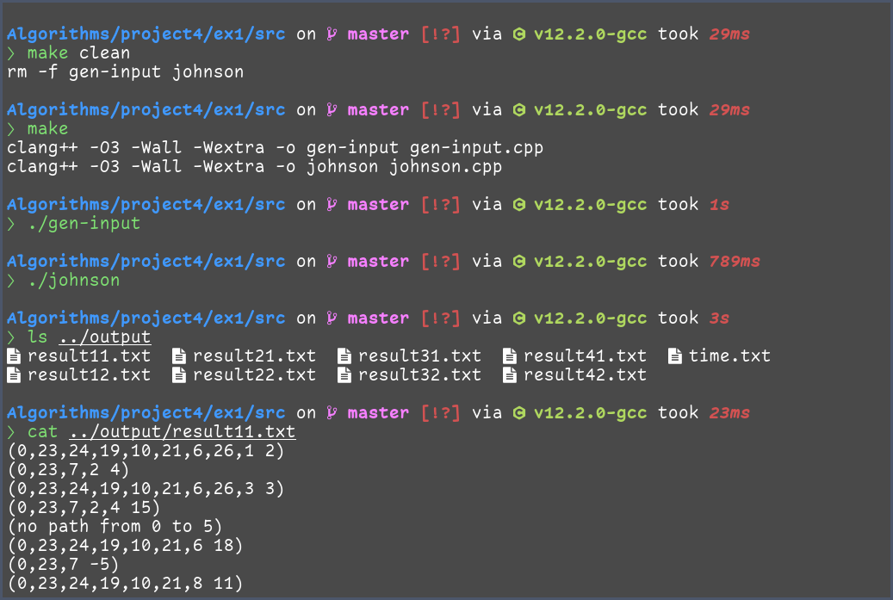
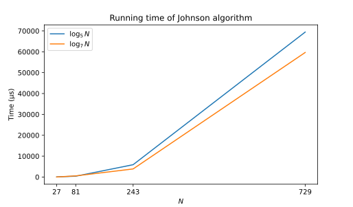

# 实验四 图算法

<center>
    傅申 PB20000051
</center>

[toc]

## 实验设备和环境

实验设备为我的笔记本，硬件配置如下：

- 型号为 Lenovo 小新 Air–14 2020；
- CPU 为 Intel i5-1035G1 (8) @ 3.600GHz；
- 内存为板载 DDR4 16GB

笔记本运行的系统为 Manjaro Linux，内核版本为 Linux 6.0.11-1-MANJARO x86_64。

本次实验使用的编译器为 Clang++，版本 15.0.2，采用 `O3` 编译优化。

## 实验内容及要求

### 实验内容

实现求所有点对最短路径的 Johnson 算法。有向图的顶点数 $N$ 的取值分别为：27、81、243、729，每个顶点作为起点引出的边的条数取值分别为：$\log_5N$、 $\log_7N$ （取下整）。图的输入规模总共有 $4\times 2 = 8$ 个，若同一个$N$，边的两种规模取值相等，则按后面输出要求输出两次，并在报告里说明。(不允许多重边，可以有环)

### 实验要求

- 编程要求：C/C++
- 目录格式：实验需建立根文件夹，文件夹名称为：`编号-姓名-学号-project4`，在根文件夹下需包括 `实验报告` 和 `ex1` 实验文件夹，实验文件夹包含3个子文件夹：
  - `input` 文件夹：存放输入数据
    - 每种输入规模分别建立 `txt` 文件，文件名称为 `input11.txt`, `input12.txt`, ……, `input42.txt` （第一个数字为顶点数序号 27、81、243、729，第二个数字为弧数目序号$\log_5 N$、$\log_7 N$）
    - 生成的有向图信息分别存放在对应数据规模的 `txt` 文件中
    - 每行存放一对结点 $i,j$ 序号（数字表示）和 $w_{ij}$，表示存在一条结点 $i$ 指向结点 $j$ 的边，边的权值为wij ，权值范围为 $[-10,50]$，取整数。
    - `Input` 文件中为随机生成边以及权值，实验首先应判断输入图是否包含一个权重为负值的环路，如果存在，删除负环的一条边，消除负环，实验输出为处理后数据的实验结果，并在实验报告中说明。
  - `src` 文件夹：源程序
  - `output` 文件夹：存放输出程序
    - `result.txt`：输出对应规模图中所有点对之间的最短路径包含结点序列及路径长，不同规模写到不同的 `txt` 文件中，因此共有 8 个 `txt` 文件，文件名称为`result11.txt`, `result12.txt`, …… , `result42.txt`；每行存一结点的对的最短路径，同一最短路径的结点序列用一对括号括起来输出到对应的 `txt` 文件中，并输出路径长度。若图非连通导致节点对不存在最短路径，该节点对也要单独占一行说明。
    - `time.txt`：运行时间效率的数据，不同规模的时间都写到同个文件。
    - example：对顶点为 27，边为 54 的所有点对最短路径实验输出应为：`(1,5,2 20)(1,5,9,3 50)...`，执行结果与运行时间的输出路径分别为：
      - `output/result11.txt`
      - `output/time.txt`
- 实验报告
  - 实验设备和环境、实验内容及要求、方法和步骤、结果与分析。
  - 比较实际复杂度和理论复杂度是否相同，给出分析。

## 方法和步骤

### `src` 目录结构

`src` 目录下源代码文件如下

```plaintext
src
├── config.h             <- 保存本次实验的参数，输入输出文件路径等数据
├── graph.h              <- 图的数据结构的实现 (邻接表)
├── min-priority-queue.h <- 最小优先队列的实现
├── gen-input.cpp        <- 生成输入数据的源代码
├── johnson.cpp          <- 实验的主程序，实现 Johnson 算法
└── Makefile
```

其中 `Makefile` 如下

```makefile
CXX = clang++
CFLAGS = -O3 -Wall -Wextra

all: gen-input johnson

gen-input: gen-input.cpp
	$(CXX) $(CFLAGS) -o $@ $^

johnson: johnson.cpp
	$(CXX) $(CFLAGS) -o $@ $^

clean:
	rm -f gen-input johnson

.PHONY: all clean
```

### 图的实现

在 `graph.h` 中，实现了一个极简的图数据结构，其中 `Edge` 类是边的实现，`Vertex` 类是顶点的实现，`Graph` 类是图的实现。

- `Edge` 类中有三个成员变量，分别是指示边的终点的 `dst` 、边的权值 `weight` 和指向下一条边的指针 `next`， 如下

  ```cpp
  class Edge
  {
    public:
      int dst;
      int weight;
      Edge *next;
  
      Edge(int, int weight): dst(dst), weight(weight), next(nullptr) {}
      ~Edge() {}
  };
  ```

- `Vertex` 类中只有一个成员变量 `head`，它是该顶点的边链表的头指针，如下

  ```cpp
  class Vertex
  {
    public:
      Edge *head;
  
      Vertex(): head(nullptr) {}
      Vertex(const Vertex &v) { ... }
      ~Vertex() { ... }
  
      void append(int dst, int weight) { ... } // 添加一条源自该顶点的边
      void remove(int dst) { ... }             // 从边链表中删除一条边
  };
  ```

- `Graph` 类中只有一个成员变量 `vertices`，它是图的顶点数组，顶点的标号由 0 开始， 如下

  ```cpp
  class Graph
  {
    public:
      std::vector<Vertex> vertices;
  
      Graph(int num_vertices): vertices(num_vertices) {}
      Graph(const Graph &g) { vertices = g.vertices; }
      ~Graph() {}
  
      int size() const { ... }                            // 返回图中边的数量
      void add_edge(int src, int dst, int weight) { ... } // 添加一条边
      void remove_edge(int src, int dst) { ... }          // 删除一条边
  };
  ```

可以看到，这个图的实现是非常简单的，并没有《算法导论》中的 $d$ 和 $\pi$ 数据域。在后面图算法的实现中，将会使用外部数组存储这两个数据域。

### 最小优先队列的实现

因为优先队列是服务于 Dijkstra 算法的，所以它的实现相较于普通的优先队列稍有差异。在《算法导论》中，优先队列直接使用图的顶点作为数据域，而因为我的顶点并没有 $d$ 和 $\pi$ 数据域，因此我采用另一种方法，使用三个数组来进行处理：

- `values` 存储了各个元素的值，在 Dijkstra 算法中就是 $d$ 值。
- `indices` 存储了各个元素原来的标号，在 Dijkstra 算法中就是顶点的标号，它和 `values` 是相对应的。
- `positions` 存储了标号对应的元素的位置，也就是说，`indices[positions[i]]` 就是 `i`，`values[positions[i]]` 就是标号为 `i` 的元素的值。

在这三个数组中，`values` 和 `indices` 是满足最小堆性质的，是优先队列的基础。各种操作在修改这两个堆的同时，也相应的修改了 `positions` 的值。与《算法导论》中不同的是，`decrease_key(i, key)` 函数的 `i` 指的是需要修改元素原来的标号，而不是在堆中的位置。除此之外，其他操作的实现与《算法导论》中类似。

### 输入数据生成

在 `gen-input.cpp` 中，我使用 `random` 库的 `std::uniform_int_distribution` 来随机生成边指向的顶点和权值，并使用 `set` 进行判重，避免生成重边和自环。

在随机生成图之后，调用 `break_neg_cycle()` 函数检测并破坏总权值为负的环。这个函数是基于 Bellman-Ford 算法的，它会先在图中添加一个虚拟顶点，其有指向所有其他顶点边，且权值均为 0。随后，执行 Bellman-Ford 算法，但是在检测到权值为负的环后，它会通过前驱数组 `pred` 找到这个环并删去环中的一条边，再删去虚拟顶点重新调用  `break_neg_cycle()` 检测。如下

```cpp
void break_neg_cycle(Graph &g)
{
    // Add a virtual vertex
    Vertex v;
    g.vertices.push_back(v);
    int n = g.size();
    for (int i = 0; i < n - 1; i++) {
        g.add_edge(n - 1, i, 0);
    }
    // Bellman-Ford, but when find a negative cycle, break it
    vector<int> dist(n, inf);
    vector<int> prev(n, -1);

    for (int i = 0; i < n - 1; i++) {
        for (int j = 0; j < n; j++) {
            Edge *p = g.vertices[j].head;
            while (p != nullptr) {
                if (dist[p->dst] > dist[j] + p->weight) {
                    dist[p->dst] = dist[j] + p->weight;
                    prev[p->dst] = j;
                }
                p = p->next;
            }
        }
    }

    for (int i = 0; i < n; i++) {
        Edge *p = g.vertices[i].head;
        while (p != nullptr) {
            if (dist[p->dst] > dist[i] + p->weight) {
                // Find the negative cycle
                int u = i;  // A vertex in the negative cycle
                int v;      // prev[v] = u, (u, v) is the edge to remove

                set<int> cycle;
                while (cycle.find(u) == cycle.end()) {
                    cycle.insert(u);
                    v = u;
                    u = prev[u];
                }
                g.remove_edge(u, v);
                g.vertices.pop_back();
                break_neg_cycle(g);
                return;
            }
            p = p->next;
        }
    }

    // Remove the virtual vertex
    g.vertices.pop_back();
}

```

最后，在检测删除完总权值为负的环后，将图的每条边输出到各个输入文件中。

### 图算法

因为顶点没有 $d$ 和 $\pi$ 数据域，所以 `bellman_ford()`、`dijkstra()` 是通过传入两个数组的引用来记录最短路径信息的。两个数组 `dist` 和 `prev` 分别对应 $d$ 和 $\pi$，即最短路径长和前驱顶点标号。算法的实现与《算法导论》中相同，如下

```cpp
bool bellman_ford(Graph &g, int src, vector<int> &dist, vector<int> &prev)
{
    int n = g.size();
    dist.resize(n, inf);
    prev.resize(n, -1);
    dist[src] = 0;

    for (int i = 0; i < n - 1; i++) {
        for (int j = 0; j < n; j++) {
            Edge *p = g.vertices[j].head;
            while (p != nullptr) {
                if (dist[p->dst] > dist[j] + p->weight) {
                    dist[p->dst] = dist[j] + p->weight;
                    prev[p->dst] = j;
                }
                p = p->next;
            }
        }
    }

    for (int i = 0; i < n; i++) {
        Edge *p = g.vertices[i].head;
        while (p != nullptr) {
            if (dist[p->dst] > dist[i] + p->weight) {
                return false;
            }
            p = p->next;
        }
    }
    return true;
}

void dijkstra(Graph &g, int src, vector<int> &dist, vector<int> &prev)
{
    int n = g.size();
    dist.assign(n, inf);
    prev.assign(n, -1);
    dist[src] = 0;

    MinPriorityQueue q(n);
    q.decrease_key(src, 0);

    while (!q.empty()) {
        int   u = q.extract_min();
        Edge *p = g.vertices[u].head;
        while (p != nullptr) {
            if (dist[p->dst] > dist[u] + p->weight) {
                dist[p->dst] = dist[u] + p->weight;
                prev[p->dst] = u;
                q.decrease_key(p->dst, dist[p->dst]);
            }
            p = p->next;
        }
    }
}
```

其中，`bellman_ford()` 的时间复杂度是 $O(VE)$，而由于使用的是优先队列，`dijkstra()` 的时间复杂度是 $O((V+E)\lg V)$。因为在本次实验中，$E = \Theta(V\lg V)$，所以 `bellman_ford()` 和 `dijkstra()` 的时间复杂度分别为 $O(V^2\lg V)$ 和 $O(V\lg^2 V)$。

而 `johnson()` 通过调用 `bellman_ford()` 和 `dijkstra()` 实现，并将顶点之间的最短路径长和前驱结点写入对应的参数（二维数组引用）中，如下：

```cpp
void johnson(Graph &g, vector<vector<int>> &dist, vector<vector<int>> &prev)
{
    int n = g.size();
    // Add a virtual vertex
    Vertex v;
    g.vertices.push_back(v);
    for (int i = 0; i < n; i++) {
        g.add_edge(n, i, 0);
    }
    // Bellman-Ford
    vector<int> h, p;
    if (!bellman_ford(g, n, h, p))
        throw std::invalid_argument("Negative cycle in graph");
    // Remove the virtual vertex
    g.vertices.pop_back();
    // Dijkstra
    for (int i = 0; i < n; i++) {
        Edge *e = g.vertices[i].head;
        while (e != nullptr) {
            e->weight += h[i] - h[e->dst];
            e         = e->next;
        }
    }
    dist.resize(n, vector<int>(n));
    prev.resize(n, vector<int>(n));
    for (int i = 0; i < n; i++) {
        dijkstra(g, i, dist[i], prev[i]);
        for (int j = 0; j < n; j++) {
            dist[i][j] += h[j] - h[i];
        }
    }
}
```

该算法的时间复杂度为 $O(VE\lg V)$，考虑到 $E = \Theta(V\lg V)$，时间为 $O(V^2\lg^2 V)$。

## 结果与分析

运行的结果如下图所示



可以看到程序的运行是没有问题的。相应的，删除的时间信息如下

```plaintext
(27, 2): 56152ns
(27, 1): 19333ns
(81, 2): 407011ns
(81, 2): 553804ns
(243, 3): 5910286ns
(243, 2): 3876711ns
(729, 4): 69428247ns
(729, 3): 59659942ns
```

其中两个 `(81, 2)` 对应这不同的输入。做出时间曲线如下



注意到顶点数为 27，边数为 $N\log_5 N$ 的运行时间比预计的运行时间稍长一些。我认为这可能是由存储结构导致的，因为它是第一个运行的数据，在运行时可能出现了较多的 cache miss 导致运行时间偏长。除去这个数据点之外，运行时间数据比较符合 Johnson 算法 $O(N^2\lg^2 N)$ 的时间复杂度。