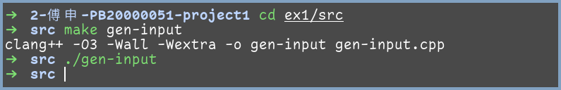
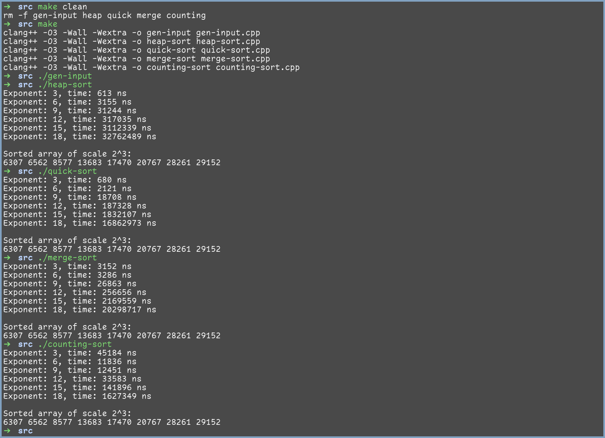
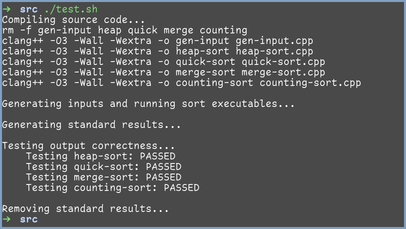
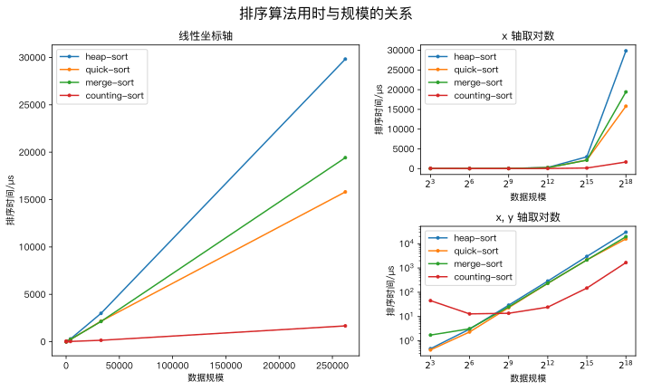
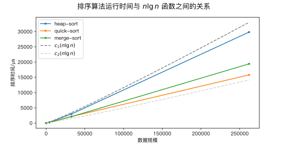

# 实验一 排序算法

<center>
    傅申 PB20000051
</center>
[toc]

## 实验内容

实现以下四个排序算法，对 $n$ 个元素进行排序，元素为随机生成的 $0$ 到 $2^{15} - 1$ 之间的整数，$n$ 的取值分别：$2^{3}, 2^{6}, 2^{9}, 2^{12}, 2^{15}, 2^{18}$。

- 堆排序
- 快速排序
- 归并排序
- 计数排序

## 实验设备和环境

实验设备为我的笔记本，硬件配置如下：

- 型号为 Lenovo 小新Air–14 2020；
- CPU 为 Intel i5-1035G1 (8) @ 3.600GHz；
- 内存为板载 DDR4 16GB

笔记本运行的系统为 Manjaro Linux，内核版本为 Linux 5.15.71-1-MANJARO x86_64。

本次实验使用的编译器为 Clang++，版本 15.0.2，采用 `O3` 编译优化。

## 实验方法和步骤

实验 `src` 文件夹下的源代码文件有

```plaintext
src
├── Makefile
├── config.h
├── gen-input.cpp
├── heap-sort.cpp
├── quick-sort.cpp
├── merge-sort.cpp
├── counting-sort.cpp
└── test.sh
```

[`Makefile`](../ex1/src/Makefile) 中的内容为

```makefile
CXX = clang++
CXXFLAGS = -O3 -Wall -Wextra

all: gen-input heap quick merge counting

gen-input: gen-input.cpp
	$(CXX) $(CXXFLAGS) -o $@ $^

heap: heap-sort.cpp
	$(CXX) $(CXXFLAGS) -o $@-sort $^

quick: quick-sort.cpp
	$(CXX) $(CXXFLAGS) -o $@-sort $^

merge: merge-sort.cpp
	$(CXX) $(CXXFLAGS) -o $@-sort $^

counting: counting-sort.cpp
	$(CXX) $(CXXFLAGS) -o $@-sort $^

clean:
	rm -f gen-input heap quick merge counting

.PHONY: all clean
```

### 全局参数

由实验内容可知，实验有如下参数

- 生成的数据最大值为 `(1 << 15) - 1`，最小值为 `0`，可以取无穷大为 `0x7FFFFFFF`。
- 需要生成数据量为 `1 << 18`；
- 需要排序的数据量有 6 个规模，分别对应 2 的 `3, 6, 9, 12, 15, 18` 次幂；
- 程序运行路径为 `ex1/src`，输入文件路径为 `../input/input.txt`，输出文件所在的文件夹为 `../output/xxx_sort/`。

因此可将它们写到 [`config.h`](../ex1/src/config.h) 中，主要部分如下

```cpp
const int max_val = (1 << 15) - 1;
const int min_val = 0;
const int inf     = 0x7FFFFFFF;

const int size = 1 << 18;

const int exps[] = {3, 6, 9, 12, 15, 18};
const int n_exps = sizeof(exps) / sizeof(int);

#define INPUT_FILE "../input/input.txt"
#define OUTPUT_DIR "../output/"
```

### 生成输入数据

可以使用 C++ `random` 库中的 `uniform_int_distribution<int>` 创造一个均匀分布，再依次生成随机数据并用 `fostream` 输出到 `INPUT_FILE` 中，共生成 `size` 个。程序源代码位于 [`gen-input.c`](../ex1/src/gen-input.cpp) 中。在命令行中转到 `src` 路径，执行如下命令就能生成输入所需的数据：

```bash
$ cd ex1/src/
$ make gen-input
$ ./gen-input
```



### 编写排序算法

#### 源代码框架

因为每个程序除了排序算法的实现不同外，其他部分的内容是大体相同的，所以使用相同的框架如下，具体的内容可见 [`../ex1/src`](../ex1/src) 中的各个源程序：

```cpp
#include "config.h"

#include <algorithm>
#include <chrono>
#include <fstream>
#include <iostream>

using std::copy;
using std::cout;
using std::endl;
using std::ifstream;
using std::ofstream;
using std::to_string;
using ns = std::chrono::nanoseconds;
auto now = std::chrono::high_resolution_clock::now;

#define TIME_FILE     OUTPUT_DIR "xxxx_sort/time.txt" // xxxx 表示具体的排序算法名称
#define OUTPUT_PREFIX OUTPUT_DIR "xxxx_sort/result_"
#define OUTPUT_SUFFIX ".txt"

// 内联函数与排序函数声明

int main()
{
    int      times[n_exps];
    int     *arrays[n_exps];
    ifstream fin(INPUT_FILE);
    ofstream fout[n_exps];
    ofstream time_file(TIME_FILE);

    // Initialize input and output files
    for (int i = 0; i < n_exps; ++i) {
        fout[i].open(OUTPUT_PREFIX + to_string(exps[i]) + OUTPUT_SUFFIX);
    }

    // Get numbers from input file
    int *data = new int[size];
    for (int i = 0; i < size; ++i) {
        fin >> data[i];
    }
    fin.close();
    for (int i = 0; i < n_exps; ++i) {
        int length = 1 << exps[i];
        arrays[i]  = new int[length];
        copy(data, data + length, arrays[i]);
    }
    delete[] data;

    // Sort numbers and get time of each scale
    for (int i = 0; i < n_exps; ++i) {
        auto start = now();
        xxxx_sort(arrays[i], 1 << exps[i]);
        auto end  = now();
        ns   time = end - start;
        times[i]  = time.count();
    }

    // Output the sorted arrays and times
    for (int i = 0; i < n_exps; ++i) {
        int length = 1 << exps[i];
        for (int j = 0; j < length; ++j)
            fout[i] << arrays[i][j] << endl;
        fout[i].close();
        time_file << exps[i] << ": " << times[i] << " ns" << endl;
    }
    time_file.close();

    // Print the time of each scale
    for (int i = 0; i < n_exps; ++i) {
        cout << "Exponent: " << exps[i] << ", time: " << times[i] << " ns"
             << endl;
    }

    // Print the sorted array of scale 2^3
    cout << endl << "Sorted array of scale 2^3:" << endl;
    for (int i = 0; i < 8; ++i)
        cout << arrays[0][i] << " ";
    cout << endl;
}

// 排序函数与其他函数的实现
```

其中计时使用 `chrono` 头文件中的 `std::chrono::high_resolution_clock::now()`，单位为纳秒。

一些排序算法中使用的 `swap()` 函数如下：

```cpp
inline void swap(int &a, int &b)
{
    int temp = a;
    a        = b;
    b        = temp;
}
```

### 堆排序

首先，因为 C++ 中的数组下标从 0 开始，所以 `parent()`, `left()`, `right()` 的实现与课本上有所不同，即

```cpp
inline int parent(int i)
{
    return (i - 1) / 2;
}

inline int left(int i)
{
    return 2 * i + 1;
}

inline int right(int i)
{
    return 2 * i + 2;
}
```

首先是维护最大堆性质的 `heapify()` 函数，这里使用迭代形式的函数：

```cpp
/** Heapify the subtree rooted at index
 * @param heap  The heap to be heapified
 * @param size  The size of the heap
 * @param index The index of the root of the subtree to be heapified
 */
void heapify(int *heap, int size, int index)
{
    int l, r, largest;
    while (index < size) {
        l       = left(index);
        r       = right(index);
        largest = index;

        if (l < size && heap[l] > heap[index])
            largest = l;

        if (r < size && heap[r] > heap[largest])
            largest = r;

        if (largest == index)
            break;

        swap(heap[index], heap[largest]);
        index = largest;
    }
}
```

然后是建堆的 `build_heap()` 函数，通过对非叶节点自底向上调用 `heapify()` 函数来将数组转化为最大堆：

```cpp
/** Build a heap from an array
 * @param array  The array to be built into a heap
 * @param length The length of the array
 */
void build_heap(int *array, int length)
{
    for (int i = (length - 1) / 2; i >= 0; --i)
        heapify(array, length, i);
}
```

最后是堆排序函数 `heap_sort()`：

```cpp
/** Heap sort
 * @param array  The array to be sorted
 * @param length The length of the array
 */
void heap_sort(int *array, int length)
{
    build_heap(array, length);
    for (int i = length - 1; i > 0; --i) {
        swap(array[0], array[i]);
        heapify(array, i, 0);
    }
}
```

### 快速排序

因为数据是随机生成的，所以可以使用最朴素的 `partition()` 函数，即选择数组最右边的元素作为哨兵：

```cpp
/** Partition the array into two parts
 * @param array  The array to be partitioned
 * @param length The length of the array
 * @return The index of the pivot
 */
int partition(int *array, int length)
{
    int pivot = array[length - 1];
    int i     = -1;
    for (int j = 0; j < length - 1; ++j) {
        if (array[j] < pivot) {
            ++i;
            swap(array[i], array[j]);
        }
    }
    swap(array[i + 1], array[length - 1]);
    return i + 1;
}
```

快速排序函数 `quick_sort()` 如下：

```cpp
/** Quick sort
 * @param array  The array to be sorted
 * @param length The length of the array
 */
void quick_sort(int *array, int length)
{
    if (length <= 1)
        return;
    int pivot = partition(array, length);
    quick_sort(array, pivot);
    quick_sort(array + pivot + 1, length - pivot - 1);
}
```

### 归并排序

归并函数 `merge()` 如下，与课本中的相同，在子数组的最右边放置值为 `inf = 0x7FFFFFFF` 的哨兵元素：

```cpp
/** Merge two sorted arrays in a continuous memory space
 * @param array  The starting address of arrays to be merged
 * @param length The length of the merged array
 * @param mid    The starting index of second array
 */
void merge(int *array, int length, int mid)
{
    int *left  = new int[mid + 1];
    int *right = new int[length - mid + 1];
    copy(array, array + mid, left);
    copy(array + mid, array + length, right);
    left[mid]           = inf;
    right[length - mid] = inf;
	
    int l = 0, r = 0;
    for (int i = 0; i < length; ++i) {
        if (left[l] < right[r]) {
            array[i] = left[l];
            ++l;
        } else {
            array[i] = right[r];
            ++r;
        }
    }
    delete[] left;
    delete[] right;
}
```

归并排序函数 `merge_sort()` 如下：

```cpp
/** Merge sort
 * @param array  The array to be sorted
 * @param length The length of the array
 */
void mergesort(int *array, int length)
{
    if (length < 2)
        return;
    int mid = length / 2;
    mergesort(array, mid);
    mergesort(array + mid, length - mid);
    merge(array, length, mid);
}
```

### 计数排序

计数排序函数 `counting_sort()` 如下：

```cpp
/** Counting sort
 * @param array  The array to be sorted
 * @param length The length of the array
 * @param max    The maximum value of the array
 */
void counting_sort(int *array, int length, int max)
{
    int *count = new int[max + 1];
    int *temp  = new int[length];
    fill(count, count + max + 1, 0);
    for (int i = 0; i < length; ++i)
        ++count[array[i]];
    for (int i = 1; i <= max; ++i)
        count[i] += count[i - 1];
    for (int i = length - 1; i >= 0; --i)
        temp[--count[array[i]]] = array[i];
    copy(temp, temp + length, array);
    delete[] count;
    delete[] temp;
}
```

### 运行各个排序程序

运行各个排序程序，输出截图如下：



可以看到四个排序算法对于 $n = 2^3$ 时的排序结果是正确的。

### 验证排序结果

采用如下的 Bash 脚本对所有的排序结果进行验证：

```bash
#!/usr/bin/env bash

cache_dir="../output/std/"
input_file="../input/input.txt"
output_dir="../output/"

# Compile source code
echo "Compiling source code..."
make clean
make all

# Generate input and run executables
echo ""
echo "Generating inputs and running sort executables..."
./gen-input >/dev/null
for m in "heap" "quick" "merge" "counting"; do
	"./$m-sort" >/dev/null
done

# Generate standard results
echo ""
echo "Generating standard results..."
mkdir $cache_dir
for i in {3..18..3}; do
	len=$((1 << i))
	head --lines=$len $input_file |
		sort --numeric-sort >"$cache_dir/result_$i.txt"
done

# Test output correctness
echo ""
echo "Testing output correctness..."
for m in "heap" "quick" "merge" "counting"; do
	flag=1
	echo -n "    Testing $m-sort: "
	# Compare each result file with generated file
	for i in {3..18..3}; do
		if ! cmp -s "$cache_dir/result_$i.txt" \
			"$output_dir/$m""_sort/result_$i.txt"; then
			echo -n "$i "
			flag=0
		fi
	done
	if [ $flag -eq 1 ]; then
		echo "PASSED"
	else
		echo "FAILED"
	fi
done

# Remove standard results
echo ""
echo "Removing standard results..."
rm -rf $cache_dir
```

运行结果如下，可知所有排序算法对所有规模的排序结果都是正确的：



## 实验结果与分析

最近一次的排序用时数据如下

| 数据规模 |   堆排序    |  快速排序   |  归并排序   |  计数排序  |
| :------: | :---------: | :---------: | :---------: | :--------: |
|  $2^3$   |   474 ns    |   422 ns    |   1727 ns   |  45197 ns  |
|  $2^6$   |   3039 ns   |   2320 ns   |   3140 ns   |  12863 ns  |
|  $2^9$   |  29349 ns   |  23266 ns   |  25065 ns   |  13634 ns  |
| $2^{12}$ |  289138 ns  |  232083 ns  |  235599 ns  |  24414 ns  |
| $2^{15}$ | 2990611 ns  | 2162864 ns  | 2135150 ns  | 148755 ns  |
| $2^{18}$ | 29827196 ns | 15810187 ns | 19423718 ns | 1666943 ns |

由此绘制出不同输入规模下的运 行时间曲线图如下，其中左边的主图两坐标轴均为线性的，右上图则对 x 轴取了对数，右下图对 x, y 轴都取了对数。



### 比较曲线与理论渐进性能

由课本可知，桶排序算法运行时间和快速排序的期望运行时间为 $O(n\lg n)$，归并排序的运行时间为 $\Theta(n\lg n)$；而从主图可以看出，三个算法的运行时间都近似于线性，但其斜率在缓慢增大，满足 $n\lg n$ 的性质，更进一步，能找到两个常数 $c_1$ 和 $c_2$，使三个算法的运行时间介于 $c_1n\lg n$ 和 $c_2 n\lg n$ 之间，如下图：（这里 $c_1=0.007\mu\text{s}$，$c_2=0.003\mu\text{s}$）



由课本又可知计数排序的运行时间为 $\Theta(k + n)$，在本次实验中 $k = 2^{15}$，假设 $T(n) = c\cdot n + d\cdot 2^{15}$，则 
$$
\lg T(n) = \lg n + \lg \left(c + d\cdot\dfrac{2^{15}}{n}\right) \approx
\begin{cases}
15 + \lg d & \lg n \leqslant 14 \\
\lg n + \lg c + \lg d& \lg n = 15\\
\lg n + \lg c & \lg n \geqslant 16
\end{cases}
$$
这与右下方的图像趋势是吻合的，除去 $n = 2^3$ 较小时反常的数据，起初运行时间的对数在一条水平线上，斜率逐渐增加，当数据规模大于 $2^{12}$ 时，运行时间近似于线性增加。在数据规模较小时出现了反常，可能与编译器优化行为等因素有关。

### 比较不同排序算法

由曲线图可知，三个基于比较的排序算法运行速度关系为：快速排序稍微快于归并排序，快速排序和归并排序快于堆排序。计数排序在数据规模较小时要慢于其他三个排序算法，在数据规模较大时要快于其他三个排序算法。而四个排序算法中，堆排序和快速排序不是稳定的排序算法，但它们是原址的；归并排序和计数排序不是原址的排序算法，但它们是稳定的。因此可以得到以下结论：

- 当数据规模较小时，若需要稳定的排序算法，则归并排序更占优势；若不需要稳定的排序算法，则快速排序更占优势。
- 当数据规模较大时，若对算法所需要的空间不敏感，则计数排序更占优势；若对算法所需要的空间敏感，则快速排序更占优势；若还要求排序算法稳定，则应该考虑其他排序算法。


