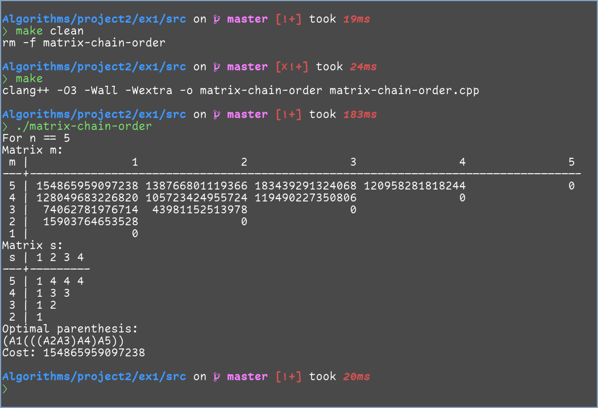
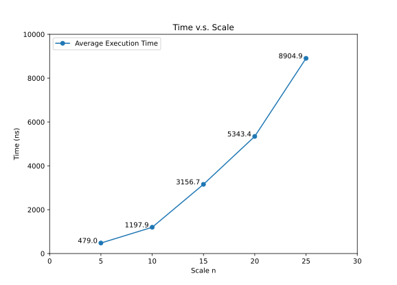
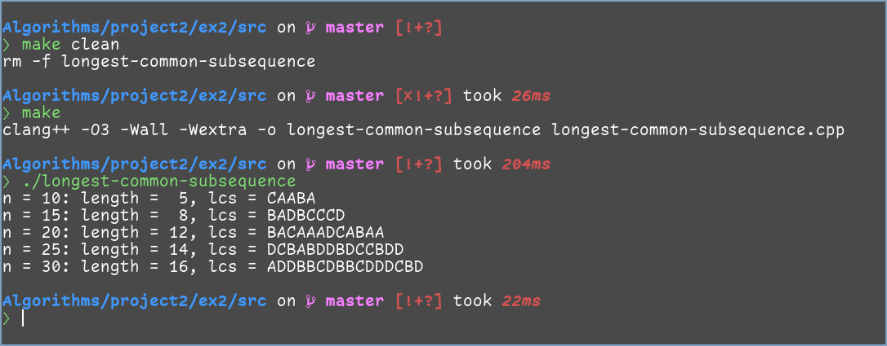

# 实验二 动态规划

<center>
    傅申 PB20000051
</center>

[toc]

## 实验设备及环境

实验设备为我的笔记本，硬件配置如下：

- 型号为 Lenovo 小新 Air–14 2020；
- CPU 为 Intel i5-1035G1 (8) @ 3.600GHz；
- 内存为板载 DDR4 16GB

笔记本运行的系统为 Manjaro Linux，内核版本为 Linux 6.0.8-1-MANJARO x86_64。

本次实验使用的编译器为 Clang++，版本 15.0.2，采用 `O3` 编译优化。

## 实验内容及要求

### 实验内容

- 实验 2.1：求矩阵链乘最优方案
  - n 个矩阵链乘，求最优链乘方案，使链乘过程中乘法运算次数最少；
  - n 的取值 5, 10, 15, 20, 25，矩阵大小见 `2_1_input.txt`；
  - 求最优链乘方案及最少乘法的运算次数，记录运行时间，画出曲线分析；
  - 仿照 P214 图 5-15，打印 `n = 5` 时的结果并截图。
- 实验 2.2：求最长公共子序列
  - 给定两个序列 `X`、`Y`，求出这两个序列的最长公共子序列（某一个即可）。
  - `X`, `Y` 序列由 `A`、`B`、`C`、`D` 四种字符构成，序列长度分别取 10、15、20、25、30，见 `2_2_input.txt`。
  - 打印最长公共子序列，记录运行时间，画出曲线分析。

### 实验要求

- 编程要求
  - C/C++
- 目录格式
  - 实验需建立根文件夹，文件夹名称为：`编号-姓名-学号-project2`，在根文件夹下需包括 `实验报告` 和 `ex1`、`ex2` 实验文件夹，每个实验文件夹包含 3 个子文件夹：
    - `input`：存放输入数据
    - `src`：存放源程序
    - `output`：存放输出数据
- 输入输出
  - 实验 2.1 矩阵链乘
    - `ex1/input/2_1_input.txt`（已给出）：每个规模的数据占两行
      - n
      - 矩阵大小向量 $p=(p_0, p_1,…, p_n)$，矩阵 $A_i$ 大小为 $p_{i−1} \times p_i$
    - `ex1/output/`
      - `result.txt`：每个规模的结果占两行
        - 最少乘法运算次数
        - 最优链乘方案（要求输出括号化方案，参考 P215 `print_opt_parens` 算法）
      - `time.txt`：每个规模的运行时间占一行
    - 同行数据间用空格隔开
  - 实验 2.2 最长公共子序列
    - `ex2/input/2_2_input.txt`（已给出）：每个规模的数据占三行
      - n：`X`、`Y` 序列长度
      - X：`X` 序列
      - Y：`Y` 序列
    - `ex2/output/`
      - `result_i.txt`：X、Y 序列长度为 i 的结果
        - 最长公共子序列长度
        - 最长公共子序列
      - `time.txt`：每个规模的运行时间占一行

- 实验报告
  - 实验报告实验设备和环境、实验内容及要求、方法和步骤、结果与分析。
  - 比较实际复杂度和理论复杂度是否相同，给出分析。

## 方法和步骤

### 实验 2.1 矩阵链乘

矩阵链乘问题满足最优子结构性质，即 $A_{i}A_{i+1}\cdots A_{j}$ 的最优解 $(A_i\cdots A_k)(A_{k+1}\cdots A_j)$ 满足 $(A_i\cdots A_k)$、$(A_{k+1}\cdots A_j)$ 分别是其子问题的最优解。因此，可以使用动态规划对问题进行求解，定义 $m[i, j]$ 为 $A_{i}A_{i+1}\cdots A_{j}$ 子问题的最优代价，则有
$$
m[i, j] = 
\begin{cases}
0 & i = j \\
\min\limits_{i\leqslant k < j} \{m[i, k] + m[k + 1, j] + p_{i - 1}p_kp_j\} & i < j
\end{cases}
$$
自底向上地依次计算 $j - i + 1$（即子链长度）从 2 到 n 的各个表项，最后就能在 $O(n^3)$ 的时间内计算出最优代价，其存储在 $m[1,n]$ 中。使用另一个表 $s$ 存储每个最优值 $m[i, j]$ 表项所对应的 $k$，就能递归构造出对应的最优解，如下：

```cpp
#define MAX_N 25
#define INFTY 9223372036854775807  // 1 << 63 - 1

long long    m[MAX_N + 1][MAX_N + 1];
unsigned int s[MAX_N][MAX_N + 1];

/**
 * @brief Calculate the minimum cost and optimal order of matrix chain
 *        multiplication using dynamic programming.
 *        The minimum cost and optimal order is stored in global table
 *        `m` and `s`.
 *        The minimum cost of the whole chain is stored in `m[1][n]`.
 * @param p The scale of each matrix. The scale of matrix i is p[i-1] * p[i]
 * @param n The number of matrices
 */
void matrix_chain_order(long long p[], unsigned int n)
{
    for (unsigned int i = 1; i <= n; ++i)
        m[i][i] = 0;
    for (unsigned int l = 2; l <= n; ++l) {
        for (unsigned int i = 1; i <= n - l + 1; ++i) {
            unsigned int j = i + l - 1;
            m[i][j]        = INFTY;
            for (unsigned int k = i; k < j; ++k) {
                long long q = m[i][k] + m[k + 1][j] + p[i - 1] * p[k] * p[j];
                if (q < m[i][j]) {
                    m[i][j] = q;
                    s[i][j] = k;
                }
            }
        }
    }
}

/**
 * @brief Print the optimal parenthesis string to file for sub-problem A`i`
 *        to A`j` using the global table `s`. 
 *        Should be called after `matrix_chain_order()`.
 *        Initial call should be `print_optimal_parens(1, n, out)`.
 * @param i   Starting index of sub-problem.
 * @param j   Ending index of sub-problem.
 * @param out The file to print the optimal parenthesis string.
 */
void print_optimal_parens(unsigned int i, unsigned int j, FILE *out)
{
    if (i == j) {
        fprintf(out, "A%u", i);
    } else {
        fprintf(out, "(");
        print_optimal_parens(i, s[i][j], out);
        print_optimal_parens(s[i][j] + 1, j, out);
        fprintf(out, ")");
    }
}
```

### 实验 2.2 最长公共子序列

最长公共子序列问题具有最优子结构性质：两个序列的 LCS 包含两个序列前缀的 LCS. 设 $X_i$, $Y_j$ 分别是 $X$ 的第 $i$ 前缀和 $Y$ 的第 $j$ 前缀，记 $c[i, j]$ 为 $X_i$ 和 $Y_j$ 的 LCS 长度，则有
$$
c[i,j] = 
\begin{cases}
0 & i = 0 \textbf{ or } j = 0 \\
c[i - 1, j - 1] + 1 & i, j > 0 \textbf{ and }x_i = y_j \\
\max (c[i, j - 1], c[i - 1, j]) & i, j > 0 \textbf{ and }x_i \neq y_j
\end{cases}
$$
由此可见，$c[i,j]$ 的值只取决于 $c[i - 1, j - 1]$, $c[i - 1, j]$, $c[i, j - 1]$，因此可以维护一个表 $b$ 帮助构造 LCS，其中 $b[i, j]$ 指向的表项对应计算 $c[i,j]$ 时所选择的子问题最优解。按行主次序计算两个表项，可以在 $O(mn)$ 时间（在本题中 $m = n$，所以是 $O(n^2)$ 时间）内计算出 LCS 的长度，存储在 $c[m, n]$（在本题中为 $c[n,n]$）中，而利用表 $b$ 可以构造出 LCS，如下：

```cpp
#define MAX_N 30

enum arrow {
    UP,
    LEFT,
    UP_LEFT
};

unsigned int c[MAX_N + 1][MAX_N + 1];
arrow        b[MAX_N + 1][MAX_N + 1];

/**
 * @brief Calculate the length of longest common subsequence using dynamic
 *        programming.
 *        The length and arrow direction of sub-problems is stored in global
 *        table `c` and `b`.
 *        The length of LCS of x and y is stored in c[m][n].
 * @param x The first string
 * @param y The second string
 * @param m The length of x
 * @param n The length of y
 */
void lcs_length(const char x[], const char y[], unsigned int m, unsigned int n)
{
    for (unsigned int i = 1; i <= m; ++i)
        c[i][0] = 0;
    for (unsigned int j = 0; j <= n; ++j)
        c[0][j] = 0;

    for (unsigned int i = 1; i <= m; ++i) {
        for (unsigned int j = 1; j <= n; ++j) {
            if (x[i - 1] == y[j - 1]) {
                c[i][j] = c[i - 1][j - 1] + 1;
                b[i][j] = UP_LEFT;变化
            } else if (c[i - 1][j] >= c[i][j - 1]) {
                c[i][j] = c[i - 1][j];
                b[i][j] = UP;
            } else {
                c[i][j] = c[i][j - 1];
                b[i][j] = LEFT;
            }
        }
    }
}

/**
 * @brief Print the longest common subsequence to file using the global
 *        table `b`.
 *        Should be called after `lcs_length()`.
 *        Initial call should be `print_lcs(x, m, n, out)`.
 * @param x The first string
 * @param i First index
 * @param j Second index
 * @param out The file to print the longest common subsequence
 */
void print_lcs(const char *x, unsigned int i, unsigned int j, FILE *out)
{
    if (i == 0 || j == 0)
        return;

    if (b[i][j] == UP_LEFT) {
        print_lcs(x, i - 1, j - 1, out);
        fputc(x[i - 1], out);
    } else if (b[i][j] == UP) {
        print_lcs(x, i - 1, j, out);
    } else {
        print_lcs(x, i, j - 1, out);
    }
}
```

### `main` 函数执行顺序

以 `ex1/src/matrix-chain-order.cpp` 为例，`main` 函数执行顺序为

```cpp
using std::chrono::duration_cast;
using ns = std::chrono::nanoseconds;
auto now = std::chrono::high_resolution_clock::now;

int main()
{
    FILE *input_fp, *result_fp, *time_fp;
    input_fp  = fopen(INPUT_FILE, "r");
    result_fp = fopen(RESULT_FILE, "w");
    time_fp   = fopen(TIME_FILE, "w");

    unsigned int n;
    long long    p[MAX_N + 1];
    
    // Flush cache
    memset(m, 0, sizeof(m));
    memset(s, 0, sizeof(s));

    while (fscanf(input_fp, "%u", &n) != EOF) {
        // Scan input
        for (unsigned int i = 0; i <= n; ++i)
            fscanf(input_fp, "%lld", &p[i]);

        // Set timer and evaluate duration
        auto begin_time = now();
        matrix_chain_order(p, n);
        auto end_time = now();
        long duration = duration_cast<ns>(end_time - begin_time).count();

        // 输出到文件和控制台，这里省略
    }
    fclose(input_fp);
    fclose(result_fp);
    fclose(time_fp);
}
```

`ex2/src/longest-common-subsequence.cpp` 的输出文件略有不同，但大体思想是一致的，即使用 `std::chrono::high_resolution_clock::now()` 对生成表项的函数计时，并以纳秒为单位记录。输出函数因为涉及到 I/O，不统计用时。

## 结果与分析

### 实验 2.1 矩阵链乘

运行程序

- 控制台上的输出为

  

- `ex1/output/result.txt` 为

  ```plaintext
  154865959097238
  (A1(((A2A3)A4)A5))
  42524697503391
  ((A1A2)(((((((A3A4)A5)A6)A7)A8)A9)A10))
  5400945319618
  ((((((((((((((A1A2)A3)A4)A5)A6)A7)A8)A9)A10)A11)A12)A13)A14)A15)
  319329979644400
  ((A1(A2(A3(A4(A5(A6(A7(A8(A9(A10(A11(A12(A13(A14A15))))))))))))))((((A16A17)A18)A19)A20))
  574911761218280
  ((A1(A2(A3(A4(A5(A6(A7(A8(A9(A10A11))))))))))(((((((((((((A12A13)A14)A15)A16)A17)A18)A19)A20)A21)A22)A23)A24)A25))
  ```

- `ex1/output/time.txt` 为

  ```plaintext
   5: 357 ns
  10: 1090 ns
  15: 2711 ns
  20: 5168 ns
  25: 8478 ns
  ```

运行 100 次程序，作出平均时间曲线如下



可以看出运行时间与 n 之间是正相关的，且表现出了类似 $O(n^3)$ 的特征。

### 实验 2.2 最长公共子序列

运行程序

- 控制台输出为

- `ex2/output/time.txt` 为

  ```plaintext
  10: 621 ns
  15: 1273 ns
  20: 1950 ns
  25: 2728 ns
  30: 3146 ns
  ```

- 各个 `ex2/output/result_*.txt` 与控制台输出一致

运行 100 次程序，作出平均时间曲线如下


可以看出运行时间与 n 之间是正相关的，但是图像更像是一条直线，猜测可能是数据范围太小导致时间图像的斜率没有发生太大的变化。
