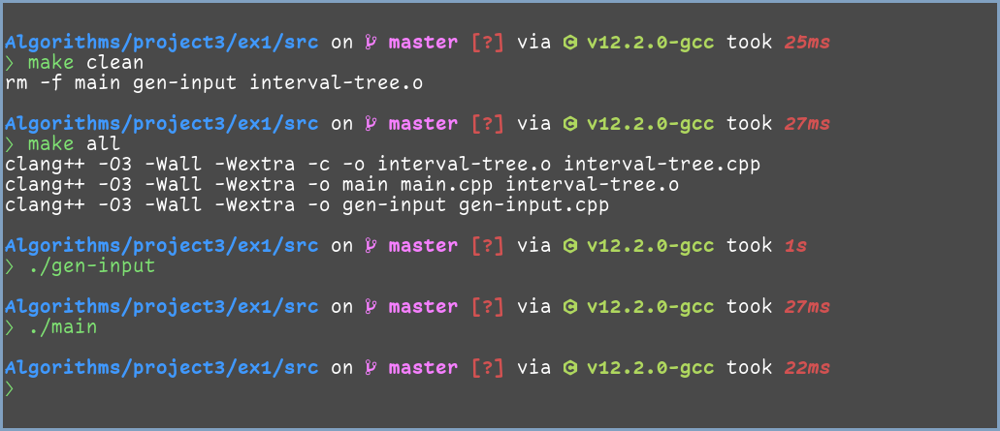
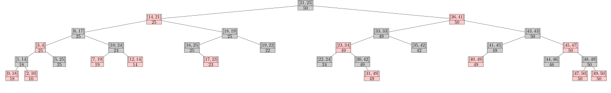
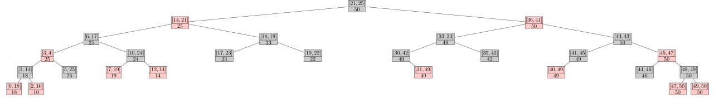

# 实验三 区间树

<center>
    傅申 PB20000051
</center>

[toc]

## 实验设备及环境

实验设备为我的笔记本，硬件配置如下：

- 型号为 Lenovo 小新 Air–14 2020；
- CPU 为 Intel i5-1035G1 (8) @ 3.600GHz；
- 内存为板载 DDR4 16GB

笔记本运行的系统为 Manjaro Linux，内核版本为 Linux 6.0.11-1-MANJARO x86_64。

本次实验使用的编译器为 Clang++，版本 15.0.2，采用 `O3` 编译优化。

## 实验内容及要求

### 实验内容

实现区间树的基本算法，随机生成 30 个正整数区间，以这 30 个正整数区间的左端点作为关键字构建红黑树，先向一棵初始空的红黑树中依次插入 30 个节点，然后随机选择其中 3 个区间进行删除，最后对随机生成的 3 个区间（其中一个区间取自 (25,30) ）进行搜索。实现区间树的插入、删除、遍历和查找算法。

### 实验要求

#### 编程要求

C/C++

#### 目录格式

实验需建立根文件夹，文件夹名称为：`编号-姓名-学号-project3`，在根文件夹下需包括 `实验报告` 和 `ex1` 实验文件夹，每个实验文件夹包含 3 个子文件夹：

- `input` 文件夹：存放输入数据
  - `input.txt`
    - 输入文件中每行两个随机数据，表示区间的左右端点，其右端点值大于左端点值，总行数大于等于 30。
    - 所有区间取自区间 [0,25] 或 [30,50] 且各区间左端点互异，不要和 (25,30) 有重叠。
    - 读取每行数据作为区间树的 `x.int` 域，并以其左端点构建红黑树，实现插入、删除、查找操作。
- `src` 文件夹：源程序
- `output` 文件夹：输出数据
  - `inorder.txt`
    - 输出构建好的区间树的中序遍历序列，每行三个非负整数，分别为各节点 `int` 域左右端点和 `max` 域的值。
  - `delete_data.txt`
    - 输出删除的数据，以及删除完成后区间树的中序遍历序列。
  - `search.txt`
    - 对随机生成的 3 个区间（其中一个区间取自 (25,30)）进行搜索得到的结果，搜索成功则返回一个与搜索区间重叠的区间，搜索失败返回 `Null`。

> 同行数据间用空格隔开

## 实验方法和步骤

### `src` 目录结构

`src` 目录下源代码文件如下

```plaintext
src
├──  gen-input.cpp     <- 随机生成输入数据
├──  interval-tree.cpp <- 区间树的实现
├──  interval-tree.h   <- 区间树的声明
├──  main.cpp          <- 主要可执行文件源代码
├──  Makefile
└──  test_debug.sh     <- 在 debug 模式下测试的脚本，可以生成
                           LaTeX 文件并编译到 pdf 以可视化区间树
```

其中 Makefile 如下

```makefile
CXX = clang++
CFLAGS = -O3 -Wall -Wextra

all: main gen-input

debug: CFLAGS += -g -DDEBUG
debug: main gen-input

main: main.cpp interval-tree.o
        $(CXX) $(CFLAGS) -o $@ $^

interval-tree.o: interval-tree.cpp
        $(CXX) $(CFLAGS) -c -o $@ $^

gen-input: gen-input.cpp
        $(CXX) $(CFLAGS) -o $@ $^

clean:
        rm -f main gen-input interval-tree.o

.PHONY: all debug clean
```

在执行 `make debug` 时，在 `main.cpp` 中宏 `DEBUG` 被设置，以实现输出区间树的 TikZ 代码到 $\LaTeX$ 文件，便于可视化红黑树。

### 区间树实现

#### 区间树结点

区间树结点的定义如下

```cpp
class IntervalNode
{
  public:
    IntervalNode *left;
    IntervalNode *right;
    IntervalNode *parent;

    bool red;

    int low;
    int high;
    int max;

    IntervalNode(int, int, IntervalNode *, IntervalNode *);
    ~IntervalNode();

    bool overlap(const IntervalNode &other) const;
    bool overlap(int, int) const;

    bool operator<(const IntervalNode &other) const;
    bool operator>(const IntervalNode &other) const;
    bool operator==(const IntervalNode &other) const;
};
```

其中 

- `left`、`right`、`parent` 指针分别指向左右孩子和父结点；

- `red` 用于标识结点是否为红色；

- `low` 和 `high` 分别为区间的左右端点；

- `max` 为子树所包含的区间端点最大值；

- `overlap()` 函数用于判断该结点包含的区间是否与参数区间有重叠，实现如下

  ```cpp
  bool IntervalNode::overlap(const IntervalNode &other) const
  {
      return overlap(other.low, other.high);
  }
  
  bool IntervalNode::overlap(int low, int high) const
  {
      return low <= this->high && high >= this->low;
  }
  ```

- 重载的比较运算符用于判断两个区间的大小关系，实现如下

  ```cpp
  bool IntervalNode::operator<(const IntervalNode &other) const
  {
      return low < other.low || (low == other.low && high < other.high);
  }
  
  bool IntervalNode::operator>(const IntervalNode &other) const
  {
      return low > other.low || (low == other.low && high > other.high);
  }
  
  bool IntervalNode::operator==(const IntervalNode &other) const
  {
      return low == other.low && high == other.high;
  }
  ```

#### 区间树

区间树的定义如下

```cpp
class IntervalTree
{
  public:
    IntervalNode *root;
    IntervalNode *nil;

    IntervalTree();
    ~IntervalTree();

    IntervalNode *insert(IntervalNode *);
    IntervalNode *insert(int, int);

    IntervalNode *remove(int, int);
    IntervalNode *remove(IntervalNode *);

    IntervalNode *search(int, int);

    IntervalNode *exact_search(int, int);

    IntervalNode *minimum(IntervalNode *);
    IntervalNode *maximum(IntervalNode *);

    void inorder_output(std::ostream &) const;
    void to_tikz(std::ostream &) const;

  private:
    void left_rotate(IntervalNode *);
    void right_rotate(IntervalNode *);
    bool update_max(IntervalNode *);
    void insert_fixup(IntervalNode *);
    void remove_fixup(IntervalNode *);
    void transplant(IntervalNode *, IntervalNode *);
};
```

其中绝大多数函数的定义与实现都与《算法导论》中红黑树的伪代码大体相同（对书中错误的 `RB-INSERT-FIXUP` 进行了改正），并加上了维护单个结点 `max` 的函数 `update_max()` 以及具体维护 `max` 的操作。

除了书中有的操作，还增加了两个参数为输出流的输出操作

- `inorder_output()`：输出区间树的中序遍历序列，每行三个整数，分别为各节点的 `low`、`high` 和 `max` 域的值；
- `to_tikz()`：将区间树转换为 TikZ 代码并输出，编译 $\LaTeX$ 文件后得到的 pdf 类似[附录](#附录：debug-模式下区间树的可视化)中的效果。

#### 维护最大值 `max`

`update_max()` 函数的实现如下，其返回值是一个 `bool` 值，只有当结点的 `max` 域发生了变化才为真：

```cpp
/**
 * Update the max value of the node and return true if the max value updated.
 */
bool IntervalTree::update_max(IntervalNode *node)
{
    int max = node->high;
    if (node->left != nil && node->left->max > max) {
        max = node->left->max;
    }
    if (node->right != nil && node->right->max > max) {
        max = node->right->max;
    }
    if (max != node->max) {
        node->max = max;
        return true;
    }
    return false;
}
```

在公开的函数中，只有 `insert()` 和 `remove()` 会改变树的结构，并且 `insert_fixup()` 和 `remove_fixup()` 中只通过旋转操作改变了树的结构。除此之外，`insert()` 直接修改了某个结点的子结点，而 `remove()` 只通过 `transplant()` 改变树的结构。因此，只需要在 `left_rotate()`、`right_rotate()`、`transplant()` 和 `insert()` 函数中显式地添加维护 `max` 的操作，如下

```cpp
void IntervalTree::left_rotate(IntervalNode *node)
{
    // 此处省略具体的实现代码
    // ...
    // 只有子结点发生了变化的结点需要更新 max
    update_max(node);
    update_max(right);
    // 整棵子树的最大值不会变化，所以不用向上更新
}

void IntervalTree::right_rotate(IntervalNode *node)
{
    // 此处省略具体的实现代码
    // ...
    // 类似上面的 left_rotate()
    update_max(node);
    update_max(left);
}

void IntervalTree::transplant(IntervalNode *old, IntervalNode *replacement)
{
    // 此处省略具体的实现代码
    // ...
    // 向上更新
    IntervalNode *node = old->parent;
    while (node != nil && update_max(node))
        node = node->parent;
}

IntervalNode *IntervalTree::insert(IntervalNode *node)
{
    // 此处省略具体的实现代码
    // ...
    // 向上更新
    while (parent != nil) {
        if (!update_max(parent))
            break;
        parent = parent->parent;
    }
    
    insert_fixup(node);
    return node;
}
```

#### 中序遍历输出

如下，使用递归的方式输出

```cpp
/**
 * Output the tree to stream by inoder traversal.
 */
void IntervalTree::inorder_output(std::ostream &os) const
{
    std::function<void(IntervalNode *, std::ostream &)> inorder_recursive =
        [&](IntervalNode *node, std::ostream &os) {
        if (node == nil)
            return;
        inorder_recursive(node->left, os);
        os << node->low << " " << node->high << " " << node->max << " "
           << std::endl;
        inorder_recursive(node->right, os);
    };
    inorder_recursive(root, os);
}
```

### `main.cpp`

定义的宏如下

```cpp
#define INTERVAL_NUM 30
#define REMOVE_NUM   3
#define QUERY_NUM    3

#define INTERVAL_MIN 0
#define INTERVAL_MAX 50
#define GAP_MIN      26
#define GAP_MAX      29

#define INPUT_FILE   "../input/input.txt"
#define INORDER_FILE "../output/inorder.txt"
#define DELETE_FILE  "../output/delete_data.txt"
#define SEARCH_FILE  "../output/search.txt"
```

在 `main.cpp` 中，通过测试 `DEBUG` 宏是否被定义来决定是否要将区间树可视化：

```cpp
// Output interval tree into a LaTeX file if in debug mode
#ifdef DEBUG
    #define TIKZ_FILE_PREFIX "../latex/tree-"

void output_tikz(const IntervalTree &tree, const string &suffix)
{
    ofstream tikz_file(TIKZ_FILE_PREFIX + suffix + ".tex");
    tree.to_tikz(tikz_file);
    tikz_file.close();
}
#else
    #define output_tikz(...) ;
#endif
```

首先从输入数据读入 30 个区间构建区间树并输出中序遍历结果

```cpp
IntervalTree tree;
// Construct interval tree from input
ifstream    fin(INPUT_FILE);
vector<int> low(INTERVAL_NUM);
vector<int> high(INTERVAL_NUM);
for (int i = 0; i < INTERVAL_NUM; ++i) {
    fin >> low[i] >> high[i];
    tree.insert(low[i], high[i]);
    // output_tikz(tree, "insert-" + to_string(i));
}
output_tikz(tree, "original");
fin.close();
ofstream inorder_file(INORDER_FILE);
tree.inorder_output(inorder_file);
inorder_file.close();
```

然后随机选择 3 个下标，删除对应的结点

```cpp
// Remove 3 nodes randomly
vector<int> delete_index(INTERVAL_NUM);
for (int i = 0; i < INTERVAL_NUM; ++i)
    delete_index[i] = i;

random_device rd;
mt19937       gen(rd());
shuffle(delete_index.begin(), delete_index.end(), gen);

ofstream delete_file(DELETE_FILE);
for (int i = 0; i < REMOVE_NUM; ++i) {
    int index = delete_index[i];

    IntervalNode *removed = tree.remove(low[index], high[index]);
    delete_file << removed->low << ' ' << removed->high << ' '
                << removed->max << endl;
    // output_tikz(tree, "remove-" + to_string(i) + "-" +
    // to_string(removed->low) + "-" + to_string(removed->high));
    delete removed;
}
output_tikz(tree, "removed");
delete_file << endl;
tree.inorder_output(delete_file);
delete_file.close();
```

然后随机生成 3 个区间，并作查询

```cpp
// Search 3 intervals randomly, one of which is in the gap
vector<int> search_low(QUERY_NUM);
vector<int> search_high(QUERY_NUM);

uniform_int_distribution<int> interval_dist(INTERVAL_MIN, INTERVAL_MAX);
uniform_int_distribution<int> gap_dist(GAP_MIN, GAP_MAX);

for (int i = 0; i < QUERY_NUM - 1; ++i) {
    int bound_1    = interval_dist(gen);
    int bound_2    = interval_dist(gen);
    search_low[i]  = min(bound_1, bound_2);
    search_high[i] = max(bound_1, bound_2);
}
int gap_1 = gap_dist(gen);
int gap_2 = gap_dist(gen);

search_low[QUERY_NUM - 1]  = min(gap_1, gap_2);
search_high[QUERY_NUM - 1] = max(gap_1, gap_2);

ofstream search_file(SEARCH_FILE);
for (int i = 0; i < QUERY_NUM; ++i) {
    IntervalNode *result = tree.search(search_low[i], search_high[i]);
    search_file << search_low[i] << ' ' << search_high[i] << " -> ";
    if (result == nullptr)
        search_file << "null" << endl;
    else
        search_file << result->low << ' ' << result->high << ' '
                    << result->max << endl;
}
search_file.close();
```

## 结果与分析

>  在 release 模式下测试（即 `make all`）



生成的输入为

```plaintext
45 47
33 33
36 41
41 45
43 43
14 21
44 46
6 17
7 19
49 50
3 4
35 42
16 25
21 25
5 25
0 18
48 49
18 19
1 14
10 24
19 22
17 23
30 42
22 24
12 14
23 24
2 10
31 49
40 49
47 50
```

`output/inorder.txt` 为

```plaintext
0 18 18 
1 14 18 
2 10 10 
3 4 25 
5 25 25 
6 17 25 
7 19 19 
10 24 24 
12 14 14 
14 21 25 
16 25 25 
17 23 23 
18 19 25 
19 22 22 
21 25 50 
22 24 24 
23 24 49 
30 42 49 
31 49 49 
33 33 49 
35 42 42 
36 41 50 
40 49 49 
41 45 49 
43 43 50 
44 46 46 
45 47 50 
47 50 50 
48 49 50 
49 50 50 
```

`output/delete_data.txt` 为

```plaintext
2 10 10
48 49 50
17 23 23

0 18 18 
1 14 18 
3 4 25 
5 25 25 
6 17 25 
7 19 19 
10 24 24 
12 14 14 
14 21 25 
16 25 25 
18 19 25 
19 22 22 
21 25 50 
22 24 24 
23 24 49 
30 42 49 
31 49 49 
33 33 49 
35 42 42 
36 41 50 
40 49 49 
41 45 49 
43 43 50 
44 46 46 
45 47 50 
47 50 50 
49 50 50 
```

`search.txt` 为

```plaintext
8 32 -> 21 25 50
3 5 -> 3 4 25
29 29 -> null
```

与预期相同。

## 附录：debug 模式下区间树的可视化

> 因为删除结点的随机性，可能与上面的输出有差异

直接运行 `./test_debug.sh` 即可在 `ex1/latex/` 目录下生成两个 `tex` 文件：`tree-original.tex` 和 `tree-removed.tex`，并编译得到对应的 pdf，使用 `pdf2svg` 程序将其装换为 svg 如下

- 从输入构建的区间树：

  

- 删除 3 个结点后的区间树（删除的结点分别为 [22,24]，[23,24] 和 [16,25]）：

  

